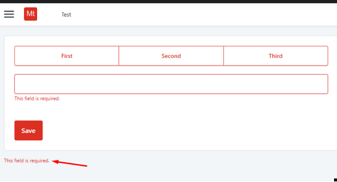
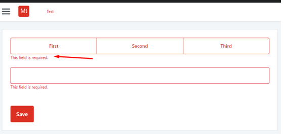

<h1>Button Group validation message in an unexpected location</h1>

<strong>Symptoms</strong>: Button Group validation message placed wrongly

<h2>Precautions</h2>

This issue seems to be observed in any version of OutSystems UI.

<h2>Troubleshooting</h2>

<ul>
    <li>When using the built in mandatory validation for the <a href="https://success.outsystems.com/documentation/11/reference/outsystems_language/interfaces/designing_screens/button_group/">Button Group</a> widget, we can see that in runtime the validation message is placed in the wrong location.</li>
    <li>It should be placed below the Button Group widget, but it is placed below the Form container instead.</li>
</ul>

<h2>Incident Resolution Measures</h2>

A workaround for this behavior consists of adding the CSS below to the screen, in order to override the bottom and left values of the <code class="editorCode">.form span.validation-message</code> properties:

<code class="editorCode">.button-group.not-valid &gt; .validation-message { 
   bottom:unset; 
   left:unset; 
}</code>

With the workaround above, the validation message is placed in the correct location, as can be seen in the screenshot below:

