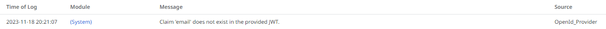
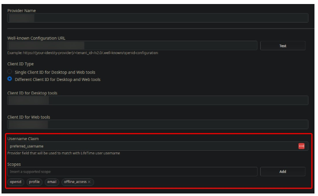

<h1>Claim 'email' does not exist in the provided JWT error when setting up Azure or Okta OIDC for LifeTime</h1>

<strong>Symptoms</strong>: Error when using Azure authentication in LifeTime, Error when using Okta authentication in LifeTime, Error when setting OpenID OIDC for LifeTime, claim email does not exist in the provided JWT

<h2>Troubleshooting</h2>

You may face the following error in Service Center’s General Logs for LifeTime when trying to implement Azure or Okta OpenID (OIDC) authentication:<code class="editorCode"><strong>claim 'email' does not exist in the provided JWT.</strong></code>

Example image from LifeTime's General Logs:

<h2>Incident Resolution Measures</h2>

This error will happen due to the <a href="https://success.outsystems.com/documentation/11/managing_the_applications_lifecycle/manage_it_users/it_users_integration_with_external_idp_via_openid_connect/configuring_lifetime_authentication/">Username claim not being correctly set</a>.

For Azure and Okta implementations, you must use the <strong>preferred_username</strong>claim in the Username Claim section, this way you will be able to proceed with using the desired implementation.

