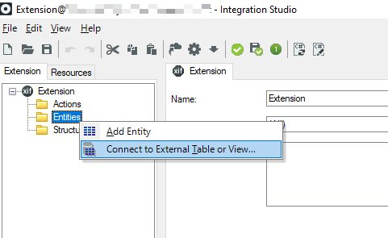
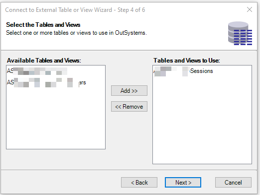
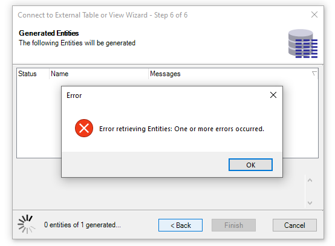
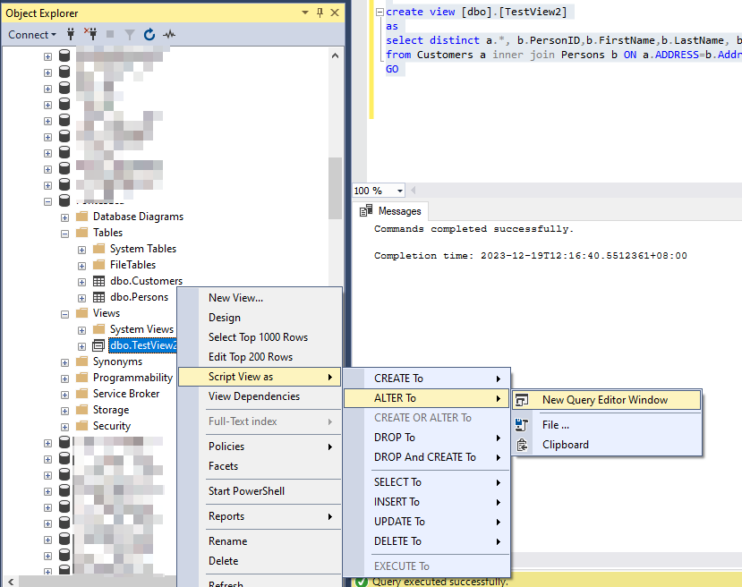

<h1>Integration Studio Error when importing a View from an external database</h1>

<strong>Symptoms</strong>: Could not find server "&lt;XX&gt;" in sys.servers, Error retrieving Entities: One or more errors occurred, Unable to import external entity from a database view, Unable to import external entity in Integration Studio

<h2>Precautions</h2>

<ul>
    <li>These issues were reported for an SQL Server external database (version 2016 and 2019).  It is unclear whether this also applies to other types of databases.</li>
    <li>Observed on Integration Studio version 11.14.19.</li>
</ul>

<h2>Troubleshooting</h2>

The problem happens in Integration Studio when trying to import a view from an external database (SQL Server) using the "Connect to External Table or View..." option:

In Step 4, a view is selected:

 In Step 6, an error window pops up: <code class="editorCode">Error retrieving Entities: One or more errors occurred.</code>

Example of a resulting error stack (from the Error logs in Service Center):

<code class="editorCode">[1] One or more errors occurred. 
   at System.Threading.Tasks.Task.ThrowIfExceptional(Boolean includeTaskCanceledExceptions) 
   at System.Threading.Tasks.Task.Wait(Int32 millisecondsTimeout, CancellationToken cancellationToken) 
   at System.Threading.Tasks.Parallel.ForWorker[TLocal](Int32 fromInclusive, Int32 toExclusive, ParallelOptions parallelOptions, Action`1 body, Action`2 bodyWithState, Func`4 bodyWithLocal, Func`1 localInit, Action`1 localFinally) 
   at System.Threading.Tasks.Parallel.ForEachWorker[TSource,TLocal](IEnumerable`1 source, ParallelOptions parallelOptions, Action`1 body, Action`2 bodyWithState, Action`3 bodyWithStateAndIndex, Func`4 bodyWithStateAndLocal, Func`5 bodyWithEverything, Func`1 localInit, Action`1 localFinally) 
   at System.Threading.Tasks.Parallel.ForEach[TSource](IEnumerable`1 source, ParallelOptions parallelOptions, Action`1 body) 
   at OutSystems.NssIntegrationStudio.CssIntegrationStudio.MssEntityIntrospectionGetEntityViews(RCEntityIntrospectionServerRecord ssserver, RLEntityIntrospectionTableNameRecordList sstableNames, RLEntityIntrospectionEntityViewRecordList&amp; ssentityViews) 
   at ssServiceCenter.RssExtensionIntegrationStudio.MssEntityIntrospectionGetEntityViews(HeContext heContext, IRecord inParamserver, RecordList inParamtableNames, RecordList&amp; outParamentityViews)</code>

<code class="editorCode">[2] <strong>Could not find server 'b' in sys.servers. Verify that the correct server name was specified. If necessary, execute the stored procedure sp_addlinkedserver to add the server to sys.servers.</strong> 
   at System.Data.SqlClient.SqlConnection.OnError(SqlException exception, Boolean breakConnection, Action`1 wrapCloseInAction) 
   at System.Data.SqlClient.TdsParser.ThrowExceptionAndWarning(TdsParserStateObject stateObj, Boolean callerHasConnectionLock, Boolean asyncClose) 
   at System.Data.SqlClient.TdsParser.TryRun(RunBehavior runBehavior, SqlCommand cmdHandler, SqlDataReader dataStream, BulkCopySimpleResultSet bulkCopyHandler, TdsParserStateObject stateObj, Boolean&amp; dataReady) 
   at System.Data.SqlClient.SqlDataReader.TryHasMoreRows(Boolean&amp; moreRows) 
   at System.Data.SqlClient.SqlDataReader.TryReadInternal(Boolean setTimeout, Boolean&amp; more) 
   at System.Data.SqlClient.SqlDataReader.Read() 
   at OutSystems.HubEdition.DatabaseProvider.SqlServer.IntrospectionService.IntrospectionService.GetPrimaryKeyColumns(TableSourceInfo tableSource) 
   at OutSystems.HubEdition.DatabaseProvider.SqlServer.IntrospectionService.IntrospectionService.&lt;GetColumns&gt;d__16.MoveNext() 
   at System.Linq.Enumerable.Count[TSource](IEnumerable`1 source, Func`2 predicate) 
   at OutSystems.NssIntegrationStudio.CssIntegrationStudio.ProcessTable(RCEntityIntrospectionServerRecord ssserver, RCEntityIntrospectionTableNameRecord table, IIntrospectionService introspectionService, IExecutionService executionService) 
   at OutSystems.NssIntegrationStudio.CssIntegrationStudio.&lt;&gt;c__DisplayClass6_0.&lt;MssEntityIntrospectionGetEntityViews&gt;b__0(RCEntityIntrospectionTableNameRecord table) 
   at System.Threading.Tasks.Parallel.&lt;&gt;c__DisplayClass31_0`2.&lt;ForEachWorker&gt;b__0(Int32 i) 
   at System.Threading.Tasks.Parallel.&lt;&gt;c__DisplayClass17_0`1.&lt;ForWorker&gt;b__1() 
   at System.Threading.Tasks.Task.InnerInvokeWithArg(Task childTask) 
   at System.Threading.Tasks.Task.&lt;&gt;c__DisplayClass176_0.&lt;ExecuteSelfReplicating&gt;b__0(Object )</code>

The error should only occur when trying to import a <a href="https://learn.microsoft.com/en-us/sql/relational-databases/views/views?view=sql-server-ver16"><strong>View</strong></a>  (virtual table whose contents are defined by a query) and is usually related to the formatting of the View's Data Definition Language (DDL) which is not properly handled by Integration Studio.  

To further investigate the issue, retrieve the View's DDL. For example, using SQL Server Management Studio, right-click on the View -&gt; Script View as -&gt; ALTER to &gt; New Query Editor Window:

Example script output:

<code class="editorCode">ALTER view [dbo].[TestView2] 
 as 
  select distinct a.*, b.PersonID,b.FirstName,b.LastName, b.City 
  from Customers a inner join Persons b ON a.ADDRESS=b.Address 
GO</code>

The next section contains common problematic scenarios and the respective workarounds to successfully import the View in Integration Studio.

<h2>Incident Resolution Measures</h2>

<h2><strong>Workarounds</strong></h2>

<h4><strong>Scenario 1:</strong></h4>

The View's DDL contains comments.

<strong>Workaround:  </strong>On the external database, alter the View's script by removing the comments.  Then try to import the View in Integration Studio again.

<h4><strong>Scenario 2:</strong></h4>

The View's DDL contains 3 or more period symbols (".") in a single string that has no whitespaces. 

<strong>Example 1:</strong> "b.PersonId,b.FirstName,b.LastName": 

<code class="editorCode">ALTER view [dbo].[TestView2] 
 as 
  select distinct a.*, b.PersonID,b.FirstName,b.LastName, b.City 
  from Customers a inner join Persons b ON a.ADDRESS=b.Address 
GO</code>

<strong>Workaround: </strong> Add a space after each comma: "b.PersonId, b.FirstName, b.LastName"

<strong>Example 2: </strong>"2.1.A."

<code class="editorCode">ALTER view [dbo].[TestView3] 
 as 
  select [id], 
    '2.1. + 2.1.A.' as [Question] 
  from TestPaper 
GO</code>

<strong>Workaround:</strong>  Remove one of the dots or replace it with another character.

<h3> </h3>

<h2><strong>Solution</strong></h2>

Install a version of Integration Studio that includes a fix for RPM-4167 (<a href="https://success.outsystems.com/support/release_notes/11/integration_studio/">Release Notes</a>).

