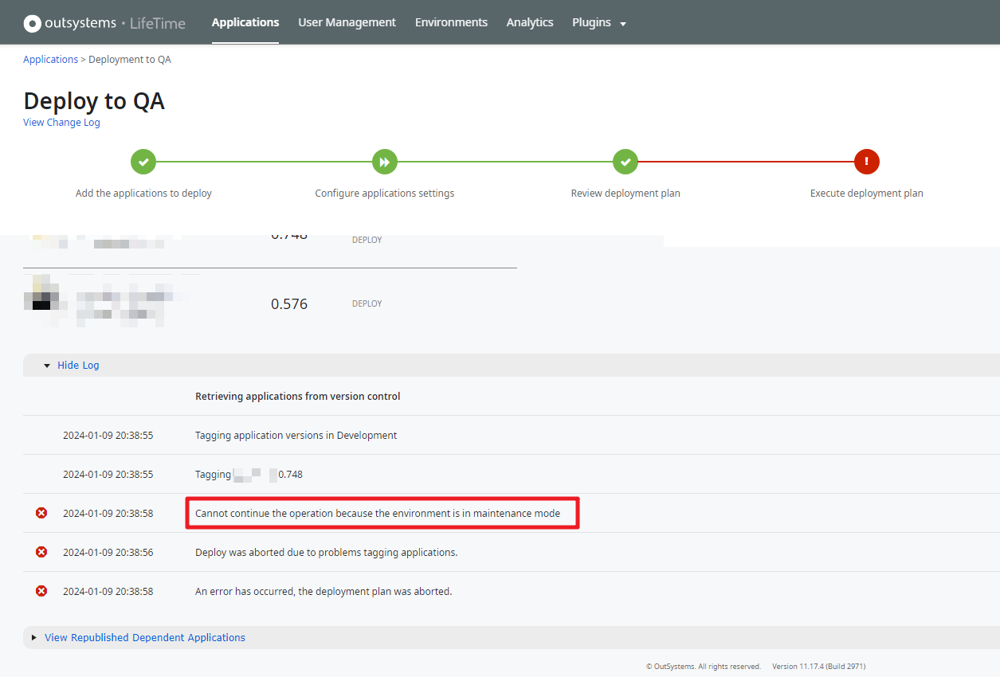
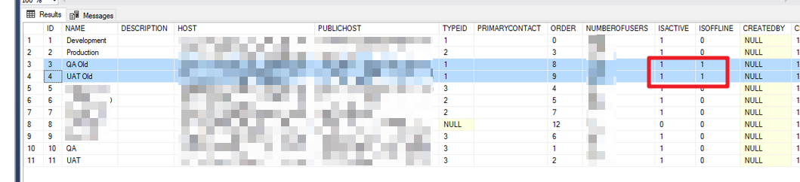
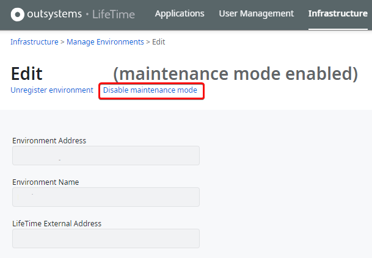

<h1>Failed deployment or tagging - Cannot continue the operation because the environment is in maintenance mode</h1>

<strong>Symptoms</strong>: Error message: "Cannot continue the operation because the environment is in maintenance mode", Deployment failure, Error when tagging applications

<h2>Precautions</h2>

<h2>Troubleshooting</h2>

This is usually reported when a deployment fails in LifeTime.  The error messages shown in the Deployment Plan's logs are:

<code class="editorCode">Cannot continue the operation because the environment is in maintenance mode</code>

<code class="editorCode">Deploy was aborted due to problems tagging applications.</code>

Below is an example of the related error stack:

<code class="editorCode">Cannot continue the operation because the environment is in maintenance mode 
   at ssLifeTimeCore.Actions.ActionSafeModuleVersionExists(HeContext heContext, RCEnvironmentRecord inParamEnvironment, RCUserRecord inParamUser, RCModuleVersionInfoRecord inParamModuleVersionInfo, Boolean&amp; outParamVersionExists, String&amp; outParamVersionHash) 
   at ssLifeTimeCore.Actions.ActionModule_ExistsVersionInEnvironment(HeContext heContext, RCEnvironmentRecord inParamEnvironment, ENModuleEntityRecord inParamModule, ENModuleVersionEntityRecord inParamModuleVersion, String&amp; outParamModuleVersionHashFound, Boolean&amp; outParamExistsVersion) 
   at ssLifeTimeEngine.RsseSpaceLifeTimeCore.MssModule_ExistsVersionInEnvironment(HeContext heContext, IRecord inParamEnvironment, IRecord inParamModule, IRecord inParamModuleVersion, String&amp; outParamModuleVersionHashFound, Boolean&amp; outParamExistsVersion) 
   at ssLifeTimeEngine.Actions.ActionApplicationVersion_UpdateRunning(HeContext heContext, Int32 inParamEnvironmentId, Int32 inParamApplicationId, Int32 inParamApplicationVersionId) 
   at ssLifeTimeEngine.Actions.ActionApplicationVersion_InnerCreate(HeContext heContext, Int32 inParamEnvironmentId, Int32 inParamApplicationId, String inParamVersionName, Int32 inParamCreatedBy, String inParamDescription, DateTime inParamCreatedOn, RLEindhoven_ModuleVersionIdList inParamModuleVersions, String inParamFrontOfficeEspaceKey, String inParamFrontOfficeEspaceName, String inParamBackOfficeEspaceKey, String inParamBackOfficeEspaceName, String inParamWebThemeGlobalKey, String inParamMobileThemeGlobalKey, String inParamTemplateKey, String inParamPrimaryColor, Boolean inParamWasAutoTagged, String inParamNativeHash, String inParamiOSVersionNumber, String inParamiOSDescription, String inParamiOSMABSVersion, String inParamAndroidVersionNumber, String inParamAndroidDescription, String inParamAndroidMABSVersion, Int32&amp; outParamId, ENApplicationVersionEntityRecord&amp; outParamApplicationVersion) 
   at ssLifeTimeEngine.Actions.ActionStaging_AutoTagResponsiveApp(HeContext heContext, RCStagingApplicationVersionRecord inParamStagingApplicationVersion, Int32 inParamEnvironmentId, Int32 inParamCreatedBy, Int32 inParamVersionComponentToIncrement, RCEindhoven_TaggedApplicationVersionRecord&amp; outParamTaggedApplicationVersion, Boolean&amp; outParamIsSuccess) 
   at ssLifeTimeEngine.Actions.ActionStaging_AutoTagApplications(HeContext heContext, Int32 inParamStagingId, Boolean inParamIsDeploying, RLEindhoven_TaggedApplicationVersionRecordList&amp; outParamTaggedApplicationVersions, Boolean&amp; outParamIsSuccess) 
   at ssLifeTimeEngine.Processes.ProcExcStaging.ActExecTagApplications.ExecuteActivity(HeContext heContext)</code>

This error will also occur during the tagging of applications.

[Note: This may not happen 100% of the time.  When retrying multiple times, some deployments may be successful.]

Some of the environments registered in LifeTime may be in Maintenance mode. To validate this, check if there are environments that are both Active and Offline in the OSLTM_ENVIRONMENT table on the LifeTime database (i.e. IsActive = 1, IsOffline = 1): <code class="editorCode">SELECT * FROM OSLTM_ENVIRONMENT</code>

Example:

For OutSystems Cloud infrastructures, environments that are in the process of being unregistered/removed will be in this Maintenance mode.

<h2>Incident Resolution Measures</h2>

<h2>Cause</h2>

This would happen in some scenarios when an environment is placed in maintenance mode and its state has not yet been fully synchronized to LifeTime.  This would affect even deployment plans that do not involve the environment that is in maintenance mode (either as source or as target).

<h2>Workarounds</h2>

<h4><strong>1. If there are environments marked as in maintenance mode in LifeTime:</strong></h4>

<ul>
    <li>Disable Maintenance mode on all environments:</li>
</ul>

<h4><strong>2. If there are no environments in maintenance mode in LifeTime:</strong></h4>

<ul>
    <li>Manually run the '<strong>Sync_All' </strong>timer on LifeTime to synchronize and update the state of all environments.</li>
</ul>

<h4><strong>3. If workarounds 1 and 2 do not work:</strong></h4>

<ul>
    <li>Note down the IDs of the environments which are in maintenance mode.  Run the following query on the LifeTime's database to retrieve this information:  <code class="editorCode">SELECT * FROM OSLTM_ENVIRONMENT WHERE ISACTIVE=1 AND ISOFFLINE=1</code></li>
    <li>
    
If there are environments that should be Active and are marked as Offline without showing the Maintenance mode in LifeTime, AND Workaround 2 (after a successful execution of the 'Sync_All' timer) did not help, further troubleshooting is required. Contact OutSystems Support to evaluate whether setting the environments' "ISOFFLINE" to "0" is safe.

    </li>
    <li>
    
If there are Offline environments marked as Active that should not be active anymore, run the update SQL query below for the IDs obtained before: 

    </li>
</ul>

<code class="editorCode">UPDATE OSLTM_ENVIRONMENT 
SET ISACTIVE = 0 
WHERE ID IN (xx, yy);</code>

<h3> </h3>

<h2>Solution</h2>

Upgrade LifeTime to a version that contains a fix for <strong>RPM-4629 </strong>(<a href="https://success.outsystems.com/support/release_notes/lifetime_management_console/">LifeTime's Release Notes</a>).

