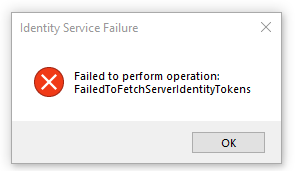
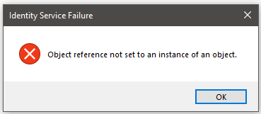

<h1>Identity Service Failure errors when connecting to Integration Studio using OIDC</h1>

<strong>Symptoms</strong>: Identity Service Failure, Failed to perform operation: FailedToFetchServerIdentityTokens, Login failure on Integration Studio, Failure connecting to Platform Server on Integration Studio

<h2>Troubleshooting</h2>

Users may report failure to log in to their environments when using Integration Studio version 11.14.23 (and maybe later versions), and when using external OIDC authentication.

The errors appear after attempts to log in:

<h4><code class="editorCode">Failed to perform operation: FailedToFetchServerIdentityTokens </code></h4>

 
<code class="editorCode">Identity Service Failure: Object reference not set to an instance of an object.</code>

Examples from Integration Studio logs:

<code class="editorCode">[2024/03/25 12:23:19.6660] OutSystems.IntegrationStudio.Interface.Aggregator.SelectServer: System.NullReferenceException: Object reference not set to an instance of an object. 
  at OutSystems.IntegrationStudio.Core.Logic.WebServices.WebServicesFacade.Handshake(ILoginInfoBase login, DatabaseProviderKey&amp; databaseProviderKey, Boolean permissionToDowngrateToHttp, IWrapMessageBox wrapMessageBox) 
  at OutSystems.IntegrationStudio.Interface.Aggregator.SelectServer.OnProcessComplete(ProofKey proofKey, String[] parameters) 
[2024/03/25 12:24:44.5483] OutSystems.IntegrationStudio.Interface.Aggregator.SelectServer: OutSystems.Communication.Exceptions.IdentityServiceException: Failed to perform operation: FailedToFetchServerIdentityTokens ---&gt; System.NullReferenceException: Object reference not set to an instance of an object. 
  at OutSystems.Communication.RESTServices.Identity.IdentityTokenRepository.&lt;&gt;c__DisplayClass4_0.b__0(TokenRepositoryKey key) 
  at System.Linq.Enumerable.WhereEnumerableIterator1.MoveNext() 
  at System.Linq.Enumerable.FirstOrDefault[TSource](IEnumerable1 source) 
  at OutSystems.Communication.RESTServices.Identity.IdentityTokenRepository.TryGet(ILoginInfoBase login, String[] scopes, IdentityToken&amp; token, TokenRepositoryKey&amp; key) 
  at OutSystems.Communication.RESTServices.Identity.IdentityTokenRepository.CreateOrReplace(ILoginInfoBase login, IdentityToken token) 
  at OutSystems.Communication.RESTServices.Identity.IdentityService.IdentityServiceTokenManager.RetrieveAndStoreIdentityToken(ILoginInfoBase loginInfo, IdentityServiceConfiguration identityServiceConfig, AuthorizationRequestInfo authRequestInfo) 
--- End of inner exception stack trace --- 
  at OutSystems.Communication.RESTServices.Identity.IdentityService.IdentityServiceTokenManager.RetrieveAndStoreIdentityToken(ILoginInfoBase loginInfo, IdentityServiceConfiguration identityServiceConfig, AuthorizationRequestInfo authRequestInfo) 
  at OutSystems.IntegrationStudio.Core.Communication.IdentityServiceManager.HandleAuthorizationPageRedirect(ProofKey proofKey, String environment, String authCode, ExtendedLoginInfoWithTokens&amp; updatedLoginInfo) 
  at OutSystems.IntegrationStudio.Interface.Aggregator.SelectServer.OnProcessComplete(ProofKey proofKey, String[] parameters)</code>

 

<h2>Incident Resolution Measures</h2>

Long-term Solution:

<ul>
    <li>Use Integration Studio 11.14.24 which includes the fix for <a href="https://success.outsystems.com/support/release_notes/11/integration_studio/#bug_fixing_integration_studio_11.14.24">RPM-4846</a>.</li>
    <li>Or upgrade Platform Server to version 11.23.0 or newer.</li>
</ul>
