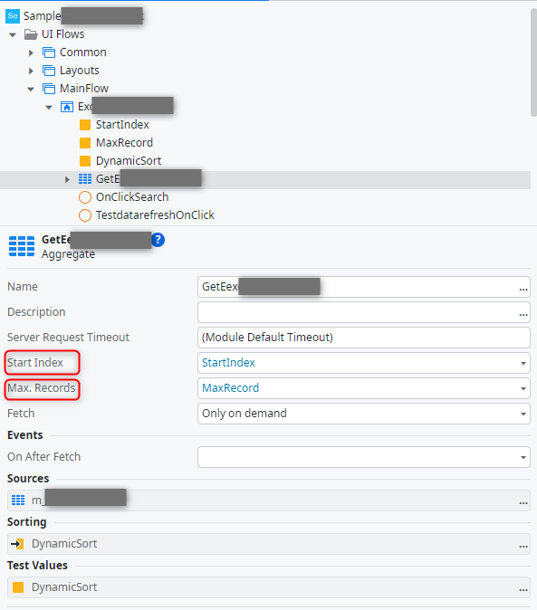
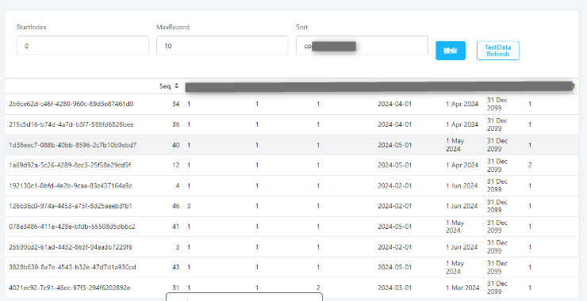
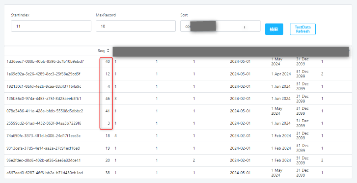
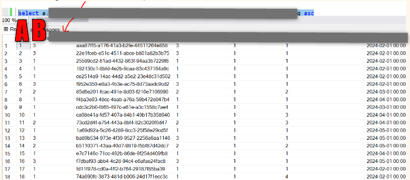

<h1>List with pagination with repeated entries in multiple pages</h1>

<strong>Symptoms</strong>: Aggregates with different StartIndex and MaxRecords returning same record(s) in different pages, List with pagination shows repeated records

<h2>Precautions</h2>

This article is applicable if the parameters Start Index and Max Records of an Aggregate are set and control the results shown in the UI (for example, a list with pagination).

<h2>Troubleshooting</h2>

It may be observed that a List with Pagination shows repeated entries in different pages of a list.  (e.g. Record X appears on pages 1 and 2, Record Y appears on pages 1 and 3, etc.)

Example:

StartIndex=0 and MaxRecord=10

Then StartIndex=11 and MaxRecords=10

There are repeated records are indicated in the screenshot above (distinct column - seq - is highlighted).

The data of the column used for sorting is not distinct.  (i.e. there are multiple records with the same values for that column)

The values of column B (which is the sorted by column) in this case is not distinct and is always having values 1, 2, or 3.

Whenever the StartIndex changes, the generated SQL query from the aggregate will not produce an output that is the same as the previous StartIndex (in terms of order of the result set returned) and thereby giving the illusion of duplicates when presented in the UI.

This is due to the TOP clause in the generated query of the aggregates coupled with the Order by of column that contain non-distinct values.

<h2>Resolution Measures</h2>

<ul>
<li>This is the expected behaviour when using Aggregates.</li>
<li>The recommended workaround is to sort by a column that has only distinct values. Or to use a combination of multiple columns to create a distinct set (for example, LastName, FirstName, EmployeeID). This will always gurantee the data returned will be in the same order and will remain so even when StartIndex changes.</li>
<li>Another workaround is to use an Advance SQL Query instead of Aggregate:</li>
<li>This is because SQL query text in Advance Queries are not optimized and are executed as they are defined in Service Studio.</li>
<li>This is in contrast to Aggregates which generate optimized queries to be executed on the database.</li>
</ul>

