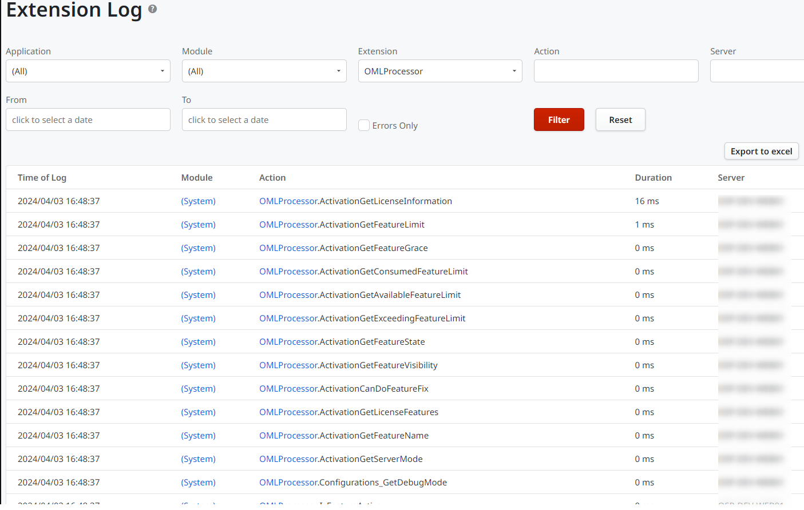
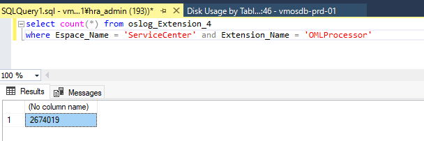
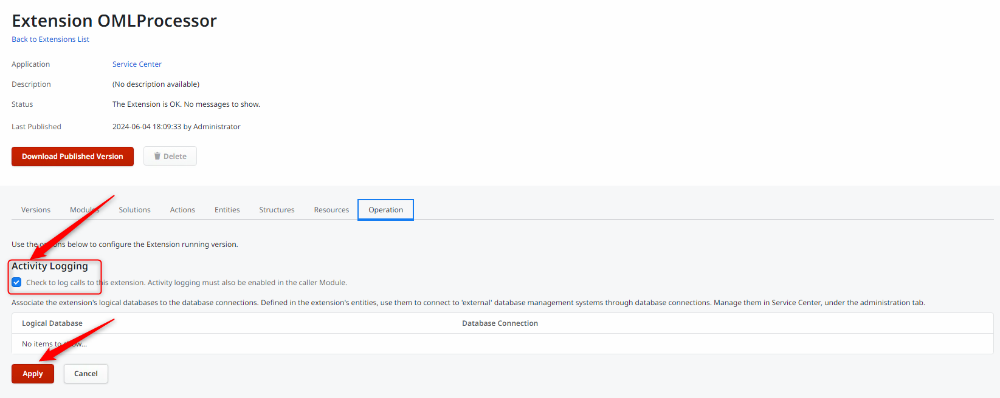
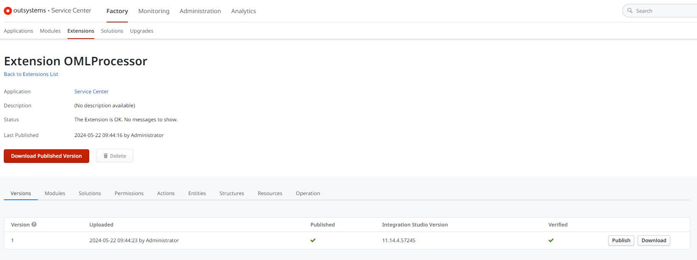

<h1>Numerous records of OMLProcessor logs</h1>

<strong>Symptoms</strong>: Rapid decrease of database free storage space, Flooding of OMLProcessor logs

<h2>Troubleshooting</h2>

The <strong>symptom </strong>is that you can see a lot of messages in the Service Center Extension Log similar to the following:

Running the following query in the database, you will get see a high number of records.  Example:

<code>select count (*) from oslog_Extension 
where Espace_Name = 'ServiceCenter' and Extension_Name = 'OMLProcessor'</code>

This log flooding is usually from the OMLProcessor extension which is a part of the System Components.

<h2>Incident Resolution Measures</h2>

The workaround to mitigate the issue is by simply <strong>disabling the OMLProcessor logs</strong>.

Please note that disabling the OMLProcessor Extension logs has no adverse side effects in terms of applications runtime and operation.

The only setback is you will not be able to find the related information that these logs will provide. However, if in future in needs of this logs when comes to troubleshoot potential issues related to extension, you can always enable it back.

<strong>Service Center and Systems Components settings shouldn't be tampered with, unless guided by OutSystems Support.</strong>

Steps to disable the OMLProcessor logs:

<ol>
<li>Navigate to <strong>https://&lt;HOSTNAME&gt;/ServiceCenter/Extension_Edit.aspx?ExtensionId=1</strong></li>
<li>Access the <strong>Operation</strong> tab</li>
<li>Proceed to uncheck <strong>Activity Logging</strong>.</li>
<li>Click <strong>Apply</strong> to save the settings.</li>
</ol>

After disabling <strong>Activity Logging</strong>, you will need to republish the extension under the <strong>Versions</strong> tab to make sure that the configurations take effect.

After disabling the Activity logging, you can check the OMLProcessor Extension logs to verify if there are any new logs.

