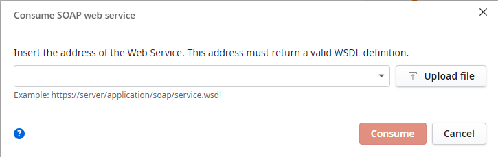
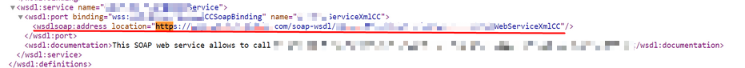

<h1>Error consuming WSDL - Invalid WSDL Root element is missing</h1>

<strong>Symptoms</strong>: 
Invalid WSDL Root element is missing, Unable to consume SOAP web service in Service Studio, Unable to import wsdl in Service Studio.

<h2>Troubleshooting Steps</h2>

When trying to consume a WSDL file in Service Studio, an error message is shown:

<code>Invalid WSDL (Detail: There is an error in XML document (0, 0). Root element is missing.)</code>

     

Verify if it occurs only when consuming via URL as opposed to consuming via "upload file" (file on local drive).

If the error occurs on both methods, evaluate if the scenario falls under <a href="https://success.outsystems.com/documentation/11/integration_with_external_systems/soap/consuming_soap_web_services/unsupported_soap_use_cases/">Unsupported SOAP Use Cases</a>.

If it is only occurring when consuming via URL, access the WSDL file on the browser and look for the "wsdlsoap:address location" value:

Verify if this address is reachable/accessible from the workstation running Service Studio (to consume the WSDL).  If the address is inaccessible, the cause of issue is probably the lack of connectivity between the workstation and that endpoint.

<h2>Incident Resolution Measures</h2>

<h3><strong>Workaround</strong></h3>

Download the WSDL file to a folder in the local drive (e.g. C:\Users\&lt;username&gt;\Downloads\) and then use "Upload file" to consume the SOAP web service, instead of using a URL.

<h3><strong>Solution</strong></h3>

On the SOAP web service side, whitelist the workstation running Service Studio to ensure successful connectivity.

