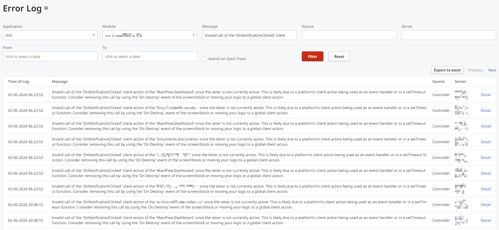
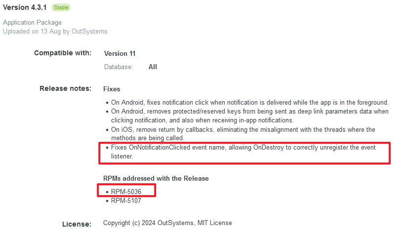
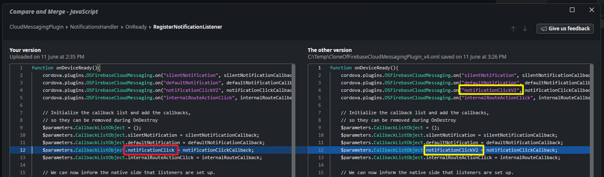

<h1>Firebase Cloud Messaging Plugin error logs with Invalid call of the OnNotificationClicked</h1>

<h3><strong>Symptoms</strong></h3>

1) The application uses OutSystems-supported <a href="https://www.outsystems.com/forge/component-versions/12174/">Cloud Messaging Plugin (Firebase)</a> between versions <strong>3.0.0</strong> to <strong>4.3.0</strong>.

2) A lot of error logs may be generated whenever a push notification is sent. Example:

<code class="editorCode">Invalid call of the 'OnNotificationClicked' client action of the 'MainFlow.Dashboard' since the latter is not currently active. This is likely due to a platform's client action being used as an event handler or in a setTimeout function. Consider removing this call by using the 'On Destroy' event of the screen/block or moving your logic to a global client action.</code>

<h3><strong>Explanation</strong></h3>

Each time a page is opened in the app, a new OnNotificationClicked listener is registered by the NotificationsHandler, while the 'old' listener, from the previous page, is not correctly removed by the OnDestroy of NotificationsHandler. That means the more pages a user visits, the more OnNotificationClicked listeners are registered. All but the last of these listeners will fail when triggered, as the underlying client action no longer exists (previous page was destroyed).

Now when a push notification is sent, all these OnNotificationClicked listeners are called, triggering an error log for all but the last listener.  So if the user visited 10 pages, that would mean 9 error logs are generated.

<h3> </h3>

<h3><strong>Solution</strong></h3>

RPM-5036 has been fixed in Cloud Messaging Plugin (Firebase) version 4.3.1, released on 13 Aug 2024. Kindly upgrade to the latest version to take advantage of the fixes.

 

<h3><strong>Workaround</strong></h3>

For whatever reason, if the Cloud Messaging Plugin (Firebase) cannot be upgraded, it would have to be patched manually:

Modify NotificationsHandler.OnReady &gt; RegisterNotificationListener (JavaScript) &gt; onDeviceReady(): 
<code class="editorCode">$parameters.CallbackListObject.notificationClick<strong>V2</strong> = notificationClickCallback;</code>

 

 

