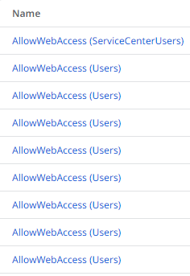
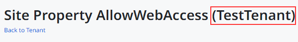

<h1>Duplicated Site Properties on the Tenant screen in Service Center</h1>

 
<strong>Symptoms</strong>: Site Property listed in the wrong Tenant , Duplicated Site Properties displayed in Service Center

<h2>Precautions</h2>

This was caused by a change implemented in Platform Server version 11.28.0, so only releases equal to or above that version should be affected.

Additionally, the issue is only expected to affect environments with over 900 eSpaces (modules and extensions).

<h2>Troubleshooting</h2>

The troubleshooting steps are meant to confirm that the issue matches the situation being investigated in RPM-5257.

On Service Center, information for individual tenants can be accessed by selecting them from the Tenant tab inside a module's details page (Service Center &gt; Factory &gt; Modules &gt; 'module name' &gt; Tenants tab). When a specific Tenant is selected, you can access that Tenant's details (Tenant_Edit.aspx page). The expected behaviour is to see a list of Site Properties that belong to modules to which the IT user has access and for that particular Tenant.

This issue causes that page to display Site Properties from other tenants, which appear as repeated entries, as exemplified in the screenshot below.

<h2>Incident Resolution Measures</h2>

The screen to edit the Site Property, accessed by selecting them from the list, will contain the information regarding the Tenant for the Site Property selected. This allows confirming if this is the desired Site Property before editing it. 

There is no other workaround available for this issue, the only solution is to upgrade to the <a href="https://success.outsystems.com/Support/Release_Notes/11/Platform_Server/">Platform Server</a> version that includes the fix to RPM-5257. 

