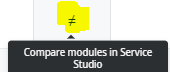
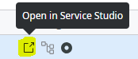
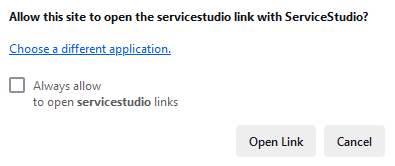
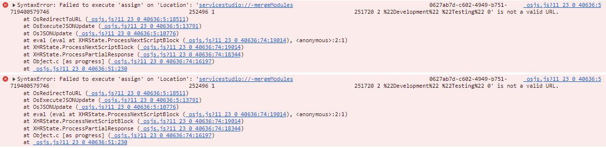

<h1>Issue opening Service Studio from LifeTime or AI Mentor Studio</h1>

<strong>Symptoms</strong>: The "Compare modules in Service Studio" option in LifeTime does not work, "Open in Service Studio" option in AI Mentor Studio does not work, "Failed to execute 'assign' on 'Location'" error.

<h2>Precautions</h2>

This issue used to affect only Chromium-based browsers (e.g. Chrome, Edge), happening after Chrome released version 130.0.6723.69/.70 for Windows, Mac and 130.0.6723.69 for Linux (<a href="https://chromereleases.googleblog.com/2024/10/stable-channel-update-for-desktop_22.html">Chrome release notes</a>).
More recently, this affects Firefox too (e.g. version 140).

<h2>Troubleshooting</h2>

LifeTime provides an option to compare module versions of different environments, using Service Studio:

While AI Mentor Studio allows to open specific modules directly on Service Studio:

In both cases, there should be a pop-up asking to open Service Studio and, if allowed, Service Studio should be automatically opened.

Due to this issue, the pop-up does not appear and Service Studio is never opened. Instead there is an error thrown in the browsers console.

<h2>Incident Resolution Measures</h2>

The issue was identified to be caused by how both LifeTime and AI Mentor Studio generate URLs.
Since a permanent solution will require reviewing the generation of URLs on both places affected, two Problem Records were created to address this issue. RPM-5292 will be focused on LifeTime while RPM-5294 is directed at AI Mentor Studio.
LifeTime version 11.25.0 (see <a href="https://success.outsystems.com/support/release_notes/lifetime_management_console/">release notes</a>) includes a fix for RPM-5292. Consider upgrading to it or a newer version.
As a workaround, run Chrome from the command line with the flag: <code>--disable-features=StandardCompliantNonSpecialSchemeURLParsing</code>
