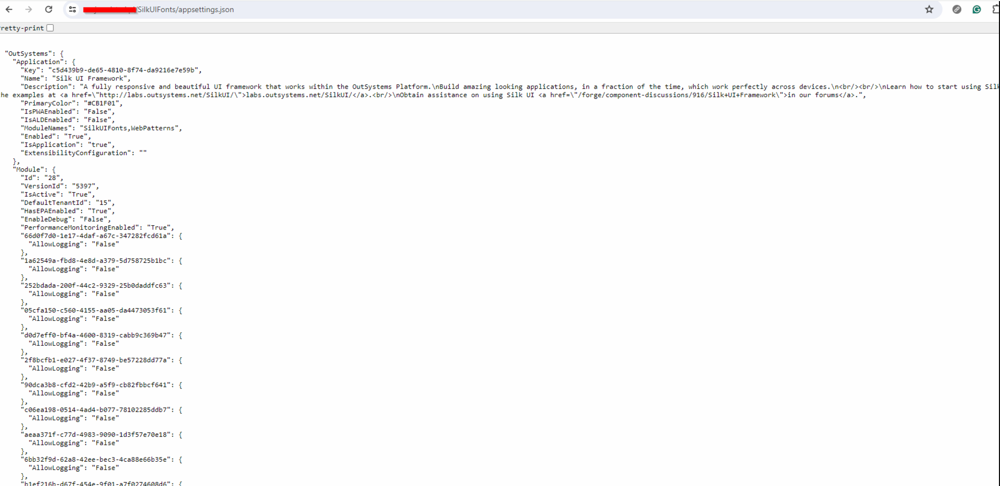
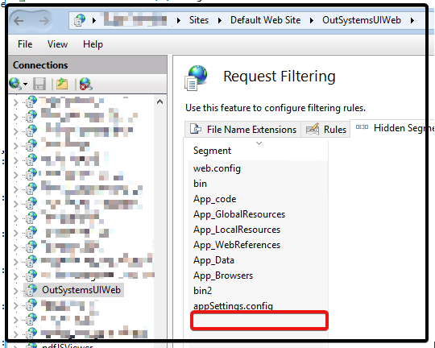
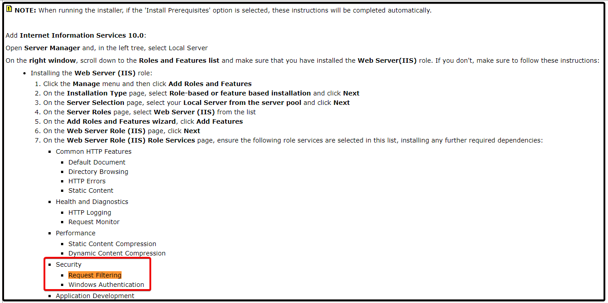
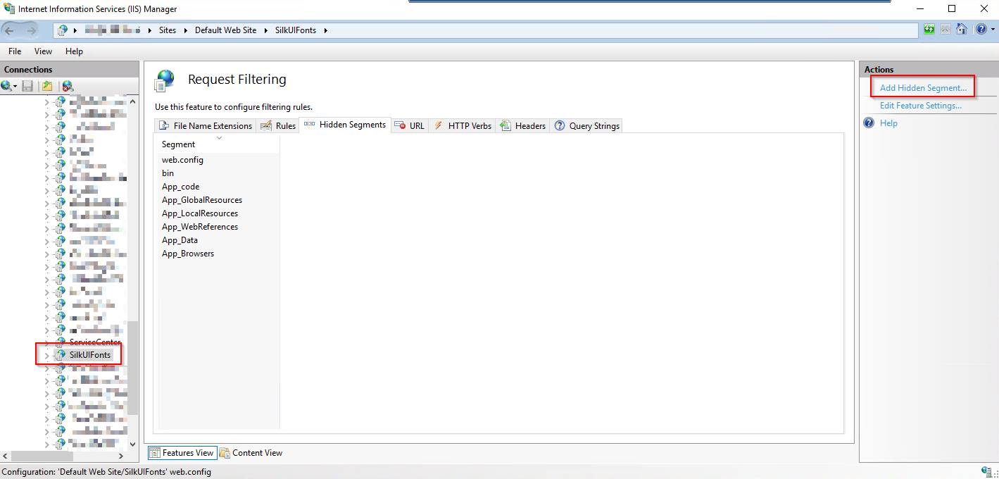
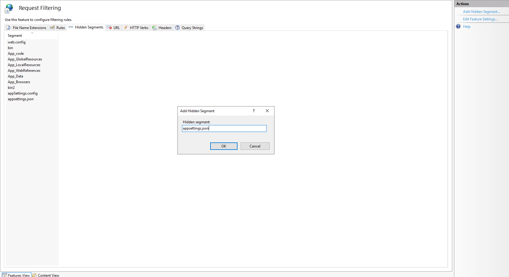

<h1>appsettings.json is publicly accessible</h1>

<h2>Issue Description</h2>
    
* It may be reported as a security risk that appsettings.json file is publicly accessible on the Internet (e.g. from the browser).
*  Using a browser, check that whether there is public access to the affected URL (https://&lt;hostname&gt;/&lt;module_name&gt;/appsettings.json) through the internet.  Example below shows successful access to the file:

    

* In the IIS Manager of the host server(s), check whether the mentioned URL (in this case appsettings.json) is present on the "Hidden Segments" tab of the Request Filtering setting of said application.

    

* Request Filtering should normally be installed with the platform as in as our platform installation checklist mentions below. So we should also check if it is activated to prevent issues on other applications.

    

<h2>Incident Resolution Measures</h2>

* Add appsettings.json to the Hidden Segments list in order to prevent access to this page. This has to be done individually to each application that has the reported issue.

    

    
