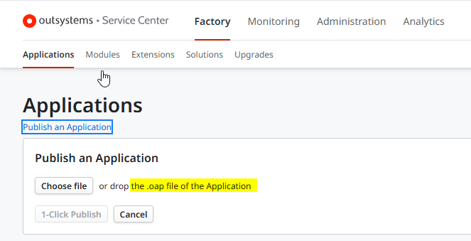
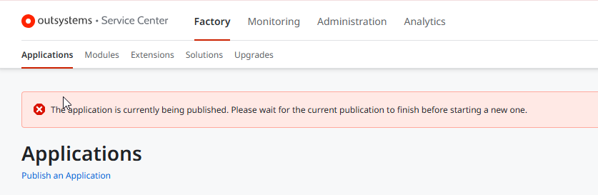
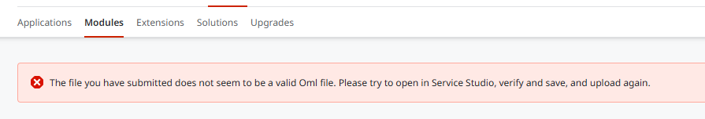
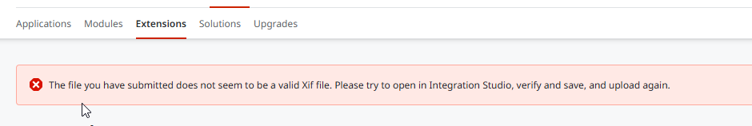
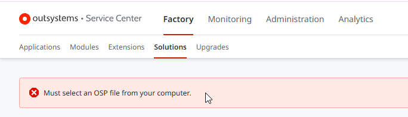

<h1>Error message - The application is currently being published. Please wait for the current publication to finish before starting a new one</h1>

<strong>Symptoms</strong>: Unable to publish application, Error: The application is currently being published, Unable to deploy application, Unable to publish
<h2>Troubleshooting</h2>

<ul>
<li>To publish an application using Service Center, it is expected to use Factory > Application > Select a valid .OAP file and 1-Click Publish:</li>

<li>If a file other than an .OAP file - such as an .OML, TXT, or .XLS file - is mistakenly uploaded, the system will display the following message by default:<code>The application is currently being published. Please wait for the current publication to finish before starting a new one.</code></li>

<li>For the other kinds of files, for example, OML (modules) and .XIF (Extension) a customized message is shown.</li>

<li>Modules:</li>

<li>Extensions:</li>
    

<li>Solutions:</li>

</ul>

<h2>Incident Resolution Measures</h2><ul><li>Ensure that the uploaded file is a valid .OAP application file.</li></ul>

