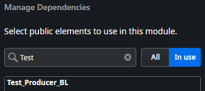
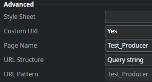
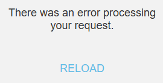
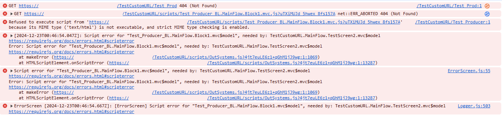
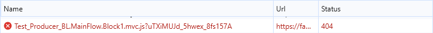
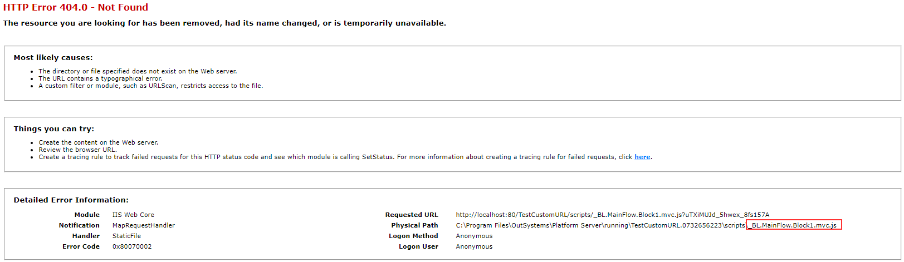

<h1>Custom URL conflict with producer module name</h1>

<strong>Symptoms</strong>: Navigating to page/screen with Custom URL leads to a 404 error, 404 error - File or directory not found, Error "Script error for , needed by: ", "There was an error processing your request" in traditional or reactive applications

<h2>Precautions</h2>

This issue occurs when a screen is configured with a <a href="https://success.outsystems.com/documentation/11/building_apps/search_engine_optimization_in_apps/seo_for_outsystems_reactive_web_apps_vs_traditional_web_apps/seo_friendly_urls_for_reactive_web_apps/#managing-custom-screen-urls">Custom URL</a>, and the Page Name section matches the beginning of the name of one of the modules it uses. 
For example, if the producer module is named "Test_Producer_BL," a screen in the consumer module with a Custom URL set to "Test_Producer" as the Page Name would trigger this issue.

<h2>Troubleshooting</h2>

When the issue happens, users are expected to be redirected to the generic "There was an error processing your request" screen, unless custom exception handling is implemented.

On the console of the browser there should be some "Script error" messages and, if the option to preserve log is enabled, the initial 404 errors should also be present.

On the Network tab there should be a request, to some resource from a Producer module, with a 404 result.

<strong>For on-premises installations</strong>: By attempting to access the resource that returns the 404 from inside the server, the 404 page should include a clue on the cause of the issue. The Physical Path presented should have part of the name of the module missing.

<h2>Incident Resolution Measures</h2>
Workarounds available:
<ul>
<li>Alter the Page Name of the Custom URL to not match the name of any module being consumed;</li>
<li>Or remove the Custom URL altogether.</li>
</ul>
Check the <a href="https://success.outsystems.com/support/release_notes/11/platform_server/">Release Notes page</a>, to validate if a permanent fix is available for the Problem Record (RPM-5366).
