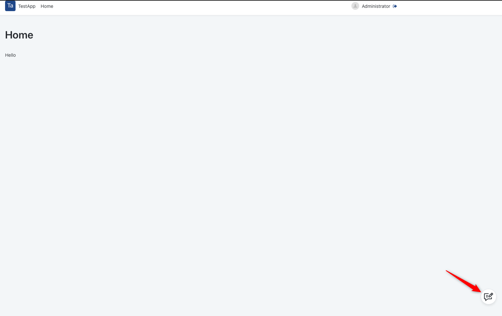
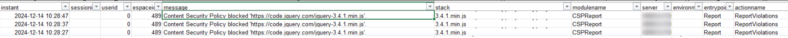
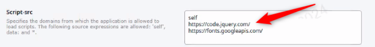

<h1>App Feedback doesn't respond due to Content Security Policy (CSP) blocks in the environment</h1>

 

 

<strong>Symptoms</strong>: App Feedback isn't usable/clickable

<h2>Precautions</h2>

None.

 

<h2>Troubleshooting</h2>

This guide applies to the following scenario:

<ul><li> 

After enabling user feedback for an app, as detailed in [Enable user feedback for apps](https://success.outsystems.com/documentation/11/monitoring_and_troubleshooting_apps/gather_user_feedback/enable_user_feedback_for_apps/), the Feedback balloon is displayed in the app. However, nothing happens when clicking on it and users can't send any feedback:

</li></ul>

<ul><li>

In the Error logs (Service Center of the affected environment), there are Content Security Policy (CSP) blocks at the time the Feedback balloon was clicked, as exemplified in the screenshot below:

</li></ul>

<ul><li>

If these errors exist, you can confirm that this troubleshooting guide is applicable and proceed to the Incident Resolution Measures section.

</li></ul>

<h2>Incident Resolution Measures</h2>

<ul><li>

As indicated by the Error logs, the problem occurs because the CSPs are blocking scripts necessary for the Feedback balloon to be triggered. Therefore, this exception needs to be added to the <strong>Script-src</strong> policy. To configure the CSPs, follow the guide at [Apply Content Security Policy](https://success.outsystems.com/documentation/11/security/apply_content_security_policy/).

</li>

<li>

The expression added should be adjusted according to the endpoint that is being blocked and that is detailed in the Error message. In this particular example, the endpoint to be added would be `https://code.jquery.com/`, as exemplified in the screenshot below:

</li>

<li>
    

The application needs to be republished to start using the new configurations.

</li></ul>
