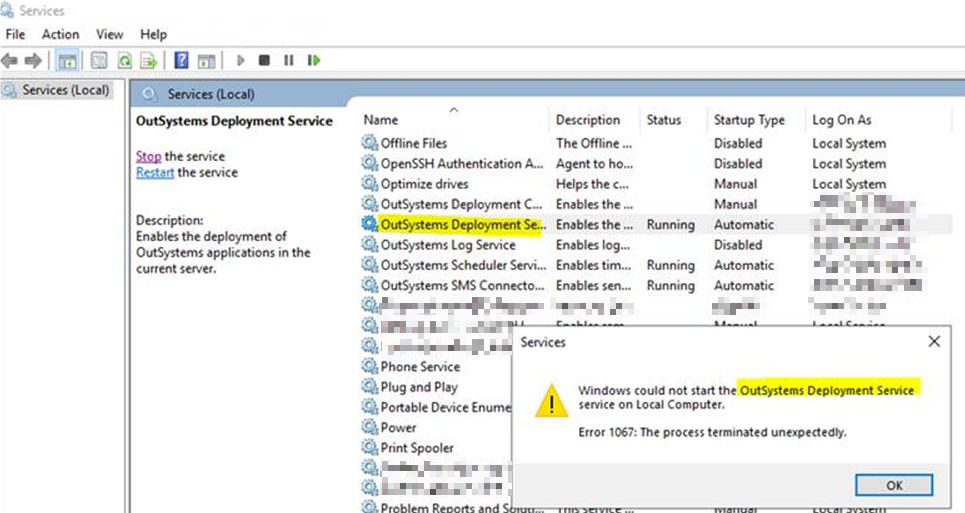
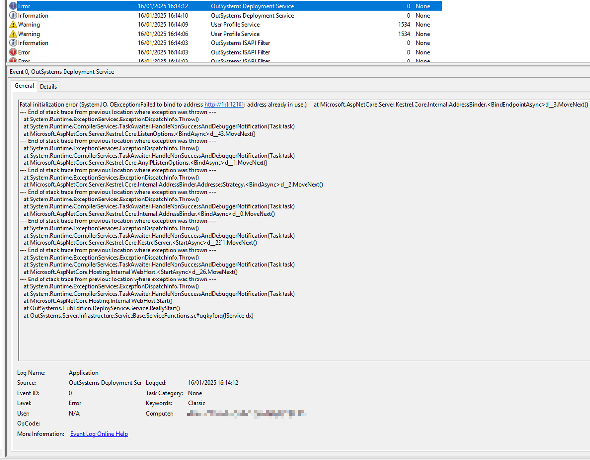
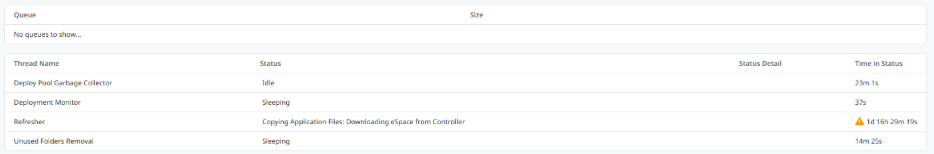
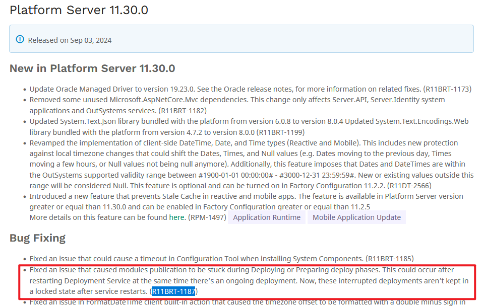

<h1>Error 1067 when trying to start deployment service</h1>

<strong>Symptoms</strong>: Deployment service fails to start, Fatal initialization error (System.IO.IO.Exception:Failed to bind to address ...: address already in use.), Error 1067: The process terminated unexpectedly, Deployment Service warning, Service Center deployment stuck, Error on Event Viewer Application logs for Deployment Controller service

<h2>Precautions</h2>

This issue should occur only on Platform Server versions 11.28 and 11.29.  The issue is fixed in PS 11.30.

<h2>Troubleshooting</h2>
<ul>
<li>Verify that when trying to start/restart the Deployment Service, there's an error: <code>Error 1067 : The process terminated unexpectedly.</code>
</li>
</ul>

<ul>
<li>
When trying to restart or stop and start the service, there's an error in the Event logs.  Example:
<ul>
<li>
<code>"Fatal initialization error (System.IO.IO.Exception:Failed to bind to address http://[::]12101: address already in use.)"</code>
</li>
<li>

</li>
</ul>
</li>
<li>
In Service Center, checking the Environment Health of the Deployment Service, it could be stuck in an action for several hours, showing a warning icon in one of the threads.  Example:
<ul>
<li>

</li>
</ul>
</li>
<li>

Verify if the network configurations are correctly setup. Refer to [OutSystems 11 network requirements](https://www.outsystems.com/tk/redirect?g=6238ecb9-6eaf-4406-a421-f4b01322052d).

</li>
<li>
Verify as well if the port(s) are being used by any other process:
<ul>
<li>Stop the Deployment Service</li>
<li>Run netstat check in command prompt.  Example: <code>netstat -ano | findstr :12101</code>
</li>
<li>Check the process which is using the port, whether it is not the Deployment Service.</li>
</ul>
</li>
<li>

If there is nothing using the port aside from the Deployment Service, and the [OSTraces](https://www.outsystems.com/tk/redirect?g=4109983c-357c-4cf5-b51f-19ef2cda02a5) don't give any further information regarding the error, check whether a <code>pendingDeployments.ModuleDeployment.cache</code> file exists in the "Platform Server\running" folder. If it exists, proceed to the Incident Resolution Measures to mitigate the incident.
</li>
</ul>

<h2>Incident resolution measures</h2>

<strong>Mitigation</strong>
    
In order to recover from the incident:
<ol>
<li>Stop OutSystems services</li>
<li>Delete the "pendingDeployments.ModuleDeployment.cache" file in the Platform Server\running folder.  Default location: "C:\Program Files\OutSystems\Platform Server\running\".</li>
<li>Start OutSystems services again.</li>
</ol>

<strong>Long-term Solution</strong>

This is fixed in Platform Server version 11.30.0, under R11BRT-1187.  Kindly upgrade to the latest version.

