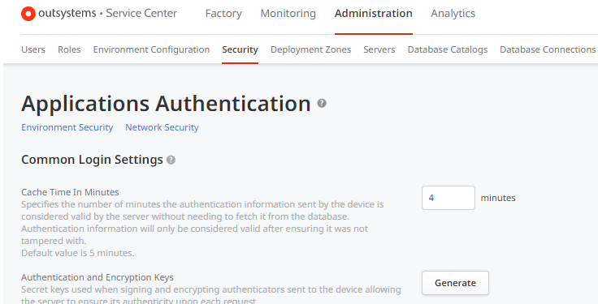

---
summary:
locale: en-us
guid: cfb71aa3-0802-4c05-8634-9912ef8c1134
app_type: traditional web apps, mobile apps, reactive web apps
platform-version: o11
figma:
---
<h1>
    Session authentication information is still usable after logging out
</h1>

 

<strong>Symptoms</strong>: User remains logged in after logout, session information usable after logout

<h2>Precautions</h2>

This behavior should not occur in environments with <a href="https://success.outsystems.com/documentation/11/security/configure_app_authentication/" target="_blank" rel="noopener noreferrer"><strong>Cache Time in Minutes</strong></a> set to 0.

<h2>Troubleshooting</h2>

    
Verify that even after logging out from an app, session information like cookies and request token can still be used to send a request to the server (and receive a valid response).

    
This can be done with the following steps:

    <ol>
        <li>Log in to the app.</li>
        <li>Capture the cookies, token and request body.</li>
        <li>Use info from Step 2 to send a request. This will be successful.</li>
        <li>Log out from the app.</li>
        <li>Repeat Step 2 to send a request. If this happens within the cache time validity, the request should still be successful even after logging out.</li>
    </ol>
    
Check the authentication information cache time value. This can be checked in Service Center &gt; Administration &gt; Security:

If it is not set to 0, this reported behavior is expected. It occurs because, even when a session is terminated, cookies sent by clients are still accepted by the server when it is within the cache time validity period. Servers accept them for a brief period of time, the default being 5 minutes. The rationale for this is to avoid pressuring the system with frequent database validations.

    
For more details, refer to <a href="https://success.outsystems.com/documentation/11/security/configure_app_authentication/" target="_blank" rel="noopener noreferrer">Configure app authentication</a>.

<h2>Incident Resolution Measures</h2>

    
In order to overcome this behavior, disable the authentication cache mechanism:

    <ol>
        <li>Set the value of Cache Time In Minutes to 0.</li>
        <li>Republish factory or the apps affected by the behavior.</li>
        <li>Test that the behavior no longer occurs.</li>
    </ol>
    
<strong>Warning:</strong> Disabling authentication cache mechanism will cause authentication to be performed much more frequently, and adds to database load.

