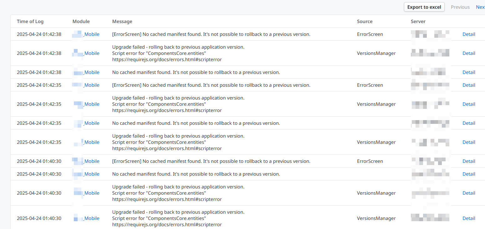
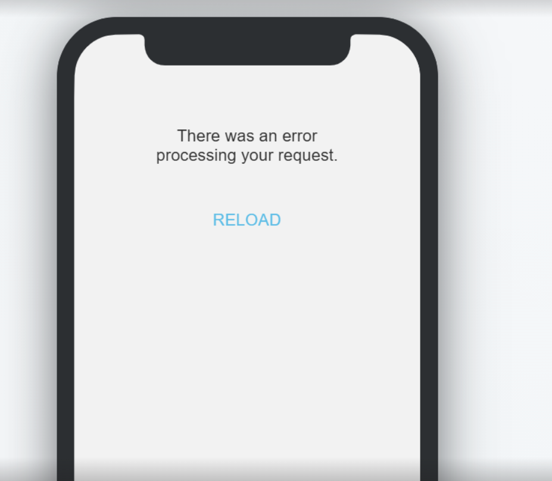
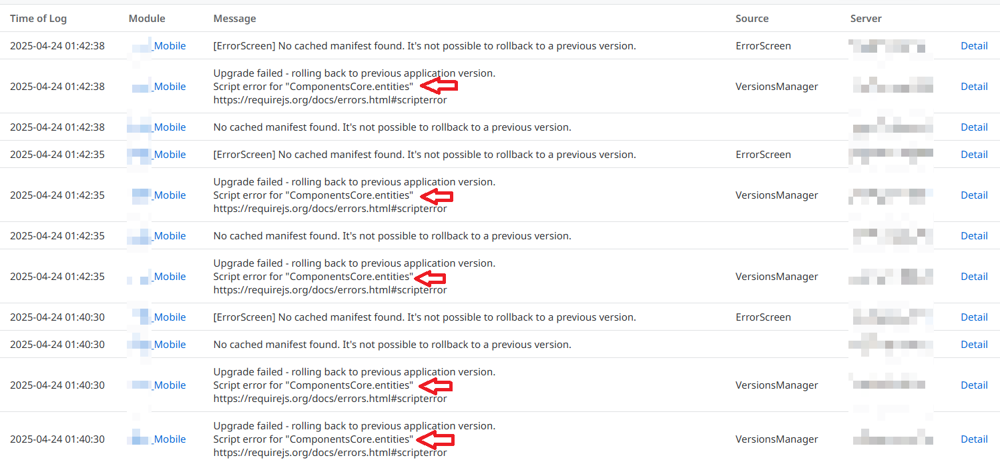
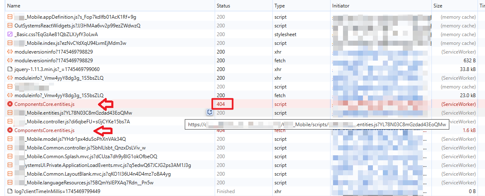
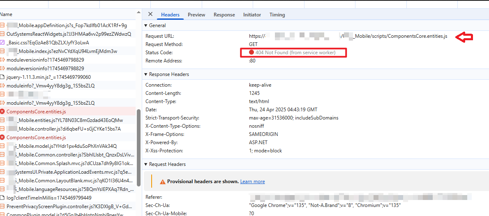
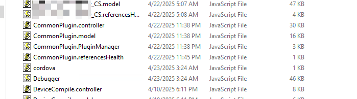
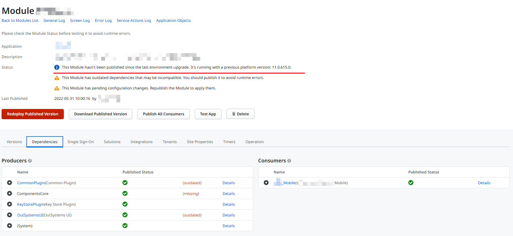

---
summary:
locale: en-us
guid: 31e57fb2-3a38-4f2e-949c-c82c533d948a
app_type: traditional web apps, mobile apps, reactive web apps
platform-version: o11
figma:
---

<h1>Rollback not possible manifest error</h1>

<strong>Symptoms</strong>: Mobile application redirects to "There was an error processing your request" screen, "no cache manifest found" shown when loading mobile application.

<h2>Precautions</h2>

This issue might have started after a platform upgrade.

<h2>Troubleshooting</h2>

It may be reported that after a platform upgrade, the following errors are encountered while loading a mobile application:
<code>No cached manifest found. It's not possible to rollback to a previous version.</code>
<code>Upgrade failed - rolling back to previous application version. Script error for "&lt;filename&gt;" https://requirejs.org/docs/errors.html#scripterror</code>

The error shown on the mobile app is: <code>There was an error processing your request</code>

Carefully review all the relevant errors from the Error log. For instance, in the error log shown below, the error is related to "ComponentsCore.entities".

Confirm if this is also seen in the HAR file.

Proceed to verify if the file exists in the module's running folder.
In the example below:
    ComponentsCore.entities.js doesn't exist in C:\Program Files\OutSystems\Platform
    Server\running\&lt;modulename.xxxxxxx&gt;\scripts\.

If the file is indeed missing, proceed to validate the respective module. It could be due to:
<ul>
<li>The file is missing from the module;</li>
<li>The module hasn't been published since the platform upgrade (see example below):
</li>
</ul>

<h2>Incident Resolution Measures</h2>
Republish the module, resolve the dependency outdated issue and rebuild the app again.
