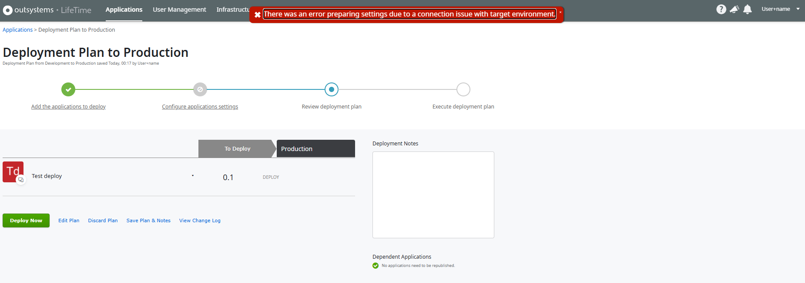
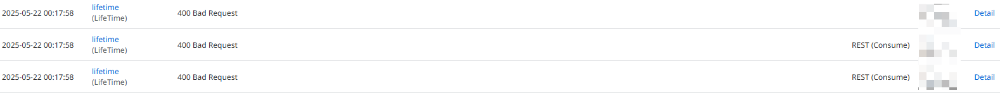
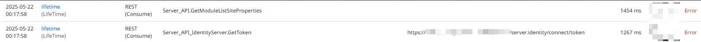
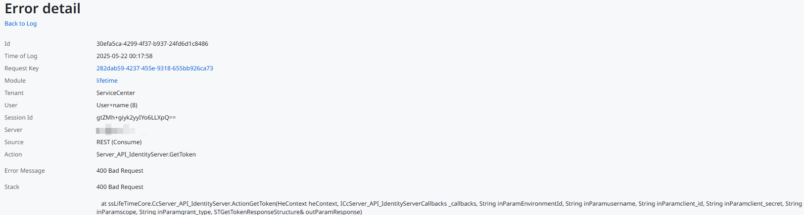
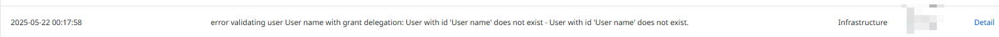
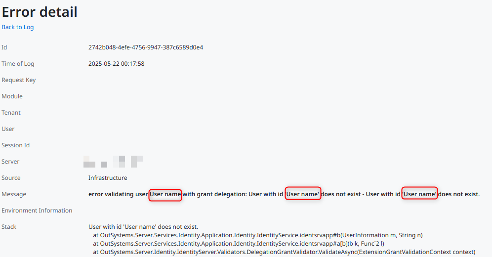
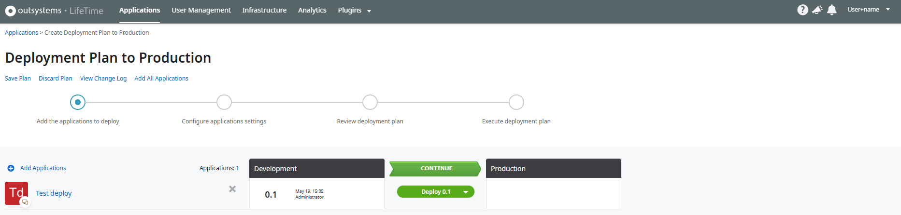

<h1>Error encountered when deploying using a user with username containing the plus character</h1>

<strong>Symptoms</strong>: There was an error preparing settings due to a connection issue with target environment, 400 Bad Request, error validating user with grant delegation, 400 Bad Request on Server_API_IdentityServer.GetToken

<h2>Troubleshooting</h2>

<strong>Symptoms:</strong>

When doing deployment through LifeTime using an IT User account with a username containing the '+' character, there will be an error:

<code>There was an error preparing settings due to a connection issue with target environment</code>

There are no errors in the source environment's Service Center.

In LifeTime's Service Center logs, we can see the following:

<li>
Error Logs
<code>400 Bad Request</code> on lifetime module
</li>

<li>
Integration Logs

Errors in calls to Server_API_IdentityServer.GetToken and Server_API.GetModuleListSiteProperties.

</li>

<code>400 Bad Request</code> on action Server_API_IdentityServer.GetToken

In the target environment's Service Center,

<li>
Error Logs

<code>Error validating user User name with grant delegation: User with id ‘User name’ does not exist - User with id ‘User name’ does not exist.</code>
    

        

       
This indicates that the username 'User+name' is being validated as 'User name' (i.e. the '+' character is replaced with space ' ')

The issue only happens after the user clicks [Continue] during staging.

The affected user is able to create applications and deployment plans without any errors.
</li>
        
<h2>Incident Resolution Measures</h2>

<strong>Long-term solution</strong>

Check release notes whether there are any releases containing a fix for RPM-5879.

<strong>Workaround:</strong>

Deploy using a user without the '+' character in the username

Usernames without '+' do not have an issue. So, if feasible, remove the '+' from the username.
        
