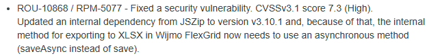
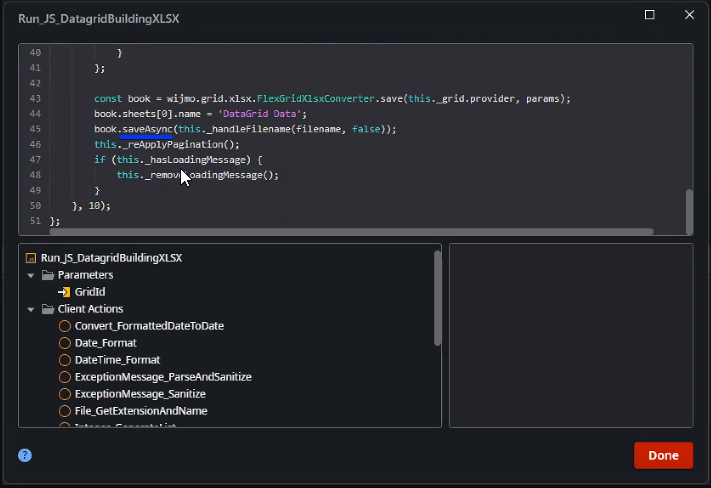

<h1>User is not able to use the Export to Excel functionality after upgrading OutSystems Data Grid.</h1>

 

 

<strong>Symptoms</strong>: Can't export to Excel after upgrading Data Grid, Error when using Data Grid, error when importing Excel

<h2>Precautions</h2>

This issue is found when you upgrade OutSystems Data Grid from a version under 2.16 to 2.16 or higher.

 

 

<h2>Troubleshooting</h2>

You notice that you have a logic to export data from OutSystems Data Grid to an Excel file, which stopped working after upgrading OutSystems Data Grid.

You confirm that you did the Upgrade from Outsystems Data Grid version 2.15 or below to 2.16 or Higher. 

 

<h2>Incident Resolution Measures</h2>

As reported on OutSystems Data Grid 2.16 Release Notes:

You need to validate the logic that is being used to Export to an Excel file (.XLSX) to confirm the method being used. We expect that you find that your method being used is the <em>save </em>and you need to change it to <em>saveAsync, </em>which is a requirement from the JSZip v3.10.1.

Example for reference of the change: 

 
