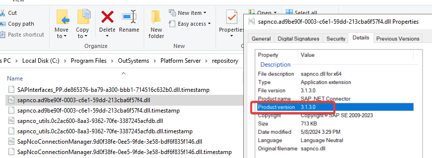

---
summary:
locale: en-us
guid: 87b468db-64e1-486d-8c88-a3ef84f28dad
app_type: traditional web apps, mobile apps, reactive web apps
platform-version: o11
figma:
isautopublish: true
---

# SAP connections failing with 'DEALLOCATED_NORMAL' error

**Symptoms**: Errors after SAP upgrade, SAP Connector Version Mismatch, DEALLOCATED_NORMAL return code from SAP connections, SAP communication errors, and SAP BAPI connection issues.

## Troubleshooting

Confirm the following before you apply the resolution steps:

* An error stack similar to the one below should be visible in Service Center's Error logs for modules using SAP connections:

```
Communication with SAP failed. SAP exception: no SAP ErrInfo available RETURN CODE: DEALLOCATED_NORMAL
[1] Communication with SAP failed. SAP exception: no SAP ErrInfo available
RETURN CODE: DEALLOCATED_NORMAL
   at OutSystems.Plugin.SAP.SapExceptionHandler.handleException()
```

* Validate if there were recent changes on the SAP connection side, for example, a recent SAP Kernel upgrade. This is the most common cause that triggers this error.
* Confirm the version of the SAP Connector for Microsoft .NET (NCo) currently installed in the environment. Review the details of the sapnco DLL available in the repository folder, for example, `C:\Program Files\OutSystems\Platform Server\repository\sapnco.XXXXX.dll`:



* If the SAP .NET Connector version is below **3.1.7**, this article applies.

## Incident Resolution Measures

Install the SAP Connector for Microsoft .NET **3.1.7** for Windows 64-bit, compiled with .NET Framework 4.6.2, following the instructions on the Platform Server installation checklist. Before you begin, make sure you have a valid SAP user account to download the connector.

### Installation

Complete the following steps to install the connector:

1. Download the SAP Connector for Microsoft .NET 3.1.7 for Windows 64-bit, compiled with .NET Framework 4.6.2, from [SAP Support Portal](https://support.sap.com/en/product/connectors/msnet.html).
1. Unblock the downloaded installer file.
1. Install the connector.
1. From the `%WINDIR%\Microsoft.NET\assembly\GAC_64\` directory, copy the `sapnco.dll` and `sapnco_utils.dll` files to the `\thirdparty\lib\` directory in the Platform Server installation directory, for example, `C:\Program Files\OutSystems\Platform Server\thirdparty\lib\`.
1. From the `%WINDIR%\Microsoft.NET\assembly\GAC_64\` directory, copy `rscp4n.dll` to the `%WINDIR%\system32\` directory.

### Post-installation steps

After you install the connector, complete the following steps:

1. Publish the **SAPDevService** module in Service Center. Go to Service Center > Factory > Modules, search for **SAPDevService**, and click the **Publish** button for the latest version of the module.
1. Publish all modules that consume SAP connections. This ensures that all consumers start using the new `sapnco.dll` version and that the old one is removed.
