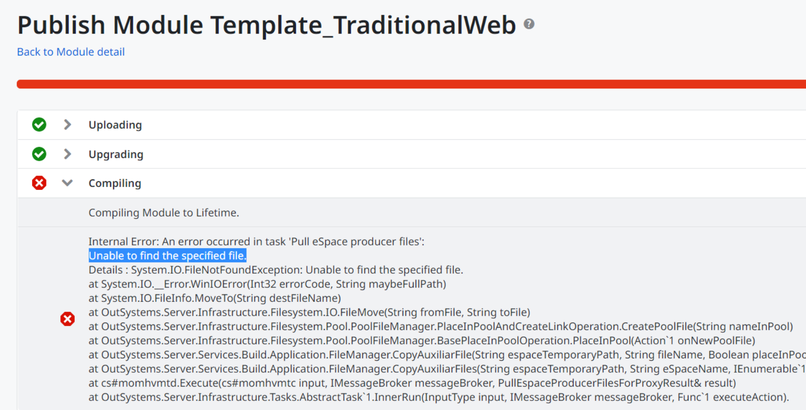
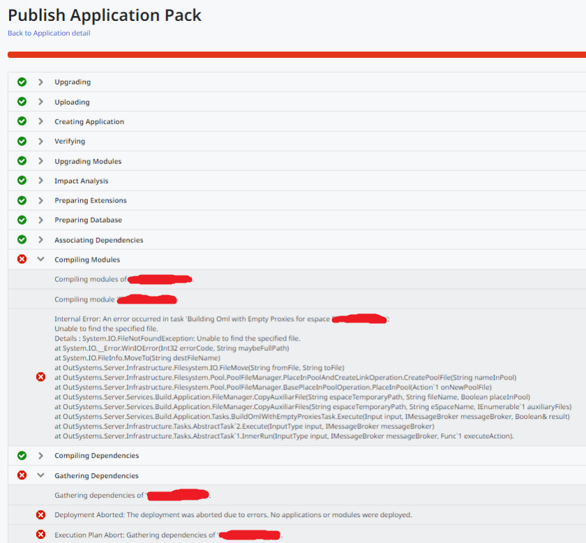
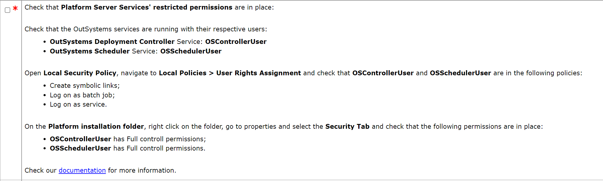
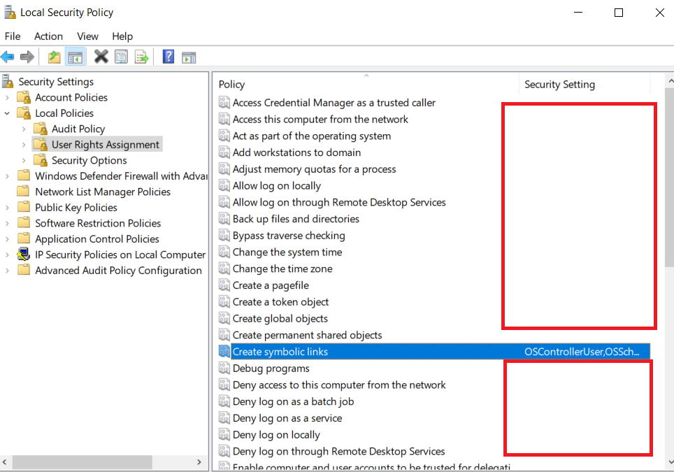

<h1>Deployment failed - Unable to find the specified file</h1>

<strong>Symptoms</strong>: Can't deploy modules/applications, Compilation error: Unable to find the specified file, Compilation error

<h2>Precautions</h2>

This problem mostly happens in on-premises environments. Identified in versions equal or later than PS 11.12.0.

<h2>Troubleshooting</h2>

The issue can be identified by the occurrence of an error similar to the following while deploying any application (in Service Studio, Service Center, or LifeTime):

<code>"Internal Error: An error occurred in task '[...]': 
Unable to find the specified file. 
Details : System.IO.FileNotFoundException: Unable to find the specified file. ... " 
  at System.IO.__Error.WinIOError(Int32 errorCode, String maybeFullPath)? 
  at System.IO.FileInfo.MoveTo(String destFileName) 
  at OutSystems.Server.Infrastructure.Filesystem.IO.FileMove(String fromFile, String toFile)</code>

Examples:

The troubleshooting path is usually the following:

<ol>
<li>Check if the deployment controller and scheduler service users have the permissions to create the symbolic links in the local security policy.</li>
<li>Make sure that the two users above have full control privileges for the installation folder.</li>
</ol>

<h2>Incident Resolution Measures</h2>

Check and set the privileges of the deployment controller and scheduler service users accordingly to the checklist. You can refer to the checklist for the correct settings.

The documentation is at <a href="https://success.outsystems.com/support/enterprise_customers/troubleshooting/service_permissions_error_when_installing_or_upgrading_to_platform_server_11_12_0_or_later/">Service permissions error when installing or upgrading to Platform Server 11.12.0 or later</a>.

<strong>Proposed Steps</strong>

<ol>
<li>In the Local Security Policies the Users referred above must have permissions to Create symbolic links.</li>
    

    
<li>Restart the OutSystems Services.</li>
<li>Retry publishing the affected Modules.</li>
</ol>
