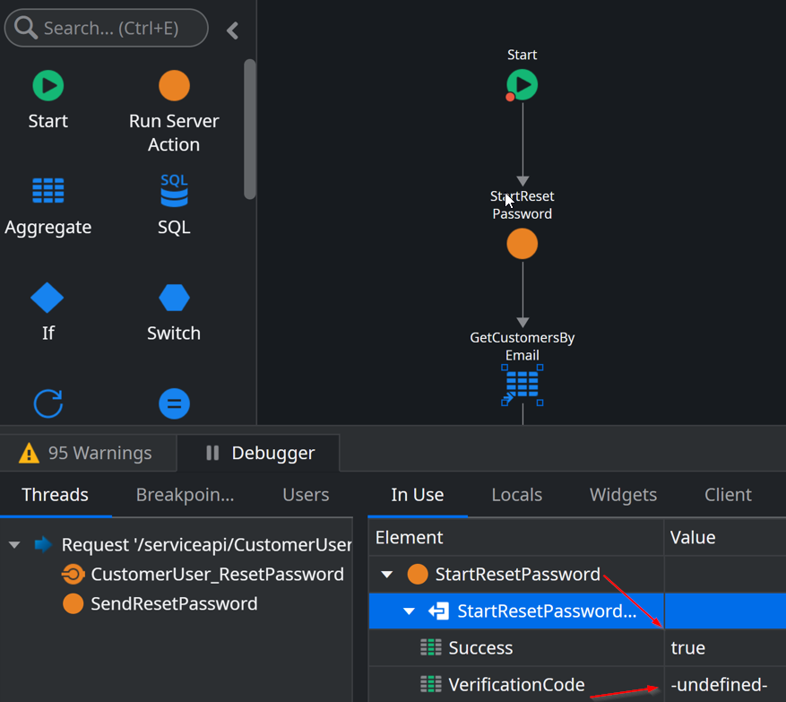

<h1>Password Reset logic does not work for some users</h1>

<strong>Symptoms</strong>: Password Reset doesn't work in applications, Issues with System Actions, undefined value in StartResetPassword Action.

<h2>Precautions</h2>

The behavior described in this Incident Model is caused by an expected restriction in the <a href="https://success.outsystems.com/documentation/outsystems_developer_cloud/outsystems_language_and_elements/system_actions/user/#startresetpassword">StartResetPassword</a> System Server Action, as described in its own documentation:

"<em>Resetting passwords for members with access to ODC Portal isn't supported through this system action, even if the member also has application roles. If this action is called with a ODC Portal member e-mail no verification code is returned. Members must always reset their password using the <strong>Forgot password?</strong> link in ODC Portal.</em>"

<h2>Troubleshooting</h2>

When using the "<a href="https://success.outsystems.com/documentation/outsystems_developer_cloud/outsystems_language_and_elements/system_actions/user/?_gl=1*1gg2cjz*_ga*MTMxNjQ3ODIxMS4xNjgzMTA5Nzg3*_ga_ZD4DTMHWR2*MTY4NDc3MjMxMC42OS4xLjE2ODQ3NzMyOTYuNTcuMC4w#startresetpassword"><strong>StartResetPassword</strong></a>" System Server Action, you may notice that some users will not get the required Verification Code that validates Password Reset they are requesting. When debugging these occurrences, you may also notice that the Attribute "VerificationCode" will be "-undefined-" even though the "Success" attribute is set to "true".

When this occurs, confirm if the user in question has Organization access (more information in our article about <a href="https://success.outsystems.com/documentation/outsystems_developer_cloud/user_management/roles/">Roles</a>).

<ul>
    <li>If they do, then your issues matches this Incident Model, and you may proceed to the Incident Resolution Measures.</li>
    <li>If the user facing this behavior only has end-user permissions, then please review your logic and, if necessary, contact our <a href="https://success.outsystems.com/support/home/">Global Support team</a>.</li>
</ul>

<h2>Incident Resolution Measures</h2>

As described in the Precautions section, this behavior is expected and it is a security measure to help prevent the inadvertent change of password of users who then may have administrator-level access to your ODC Organization.

As such, we can offer two separate suggestions:

<ul>
    <li>If you are an ODC Organization member and you need to reset your password, please use the "<strong>Forgot Password?</strong>" flow of ODC Portal.</li>
    <li>If instead you are testing your password reset logic, please use accounts that only have end user permissions.</li>
</ul>
