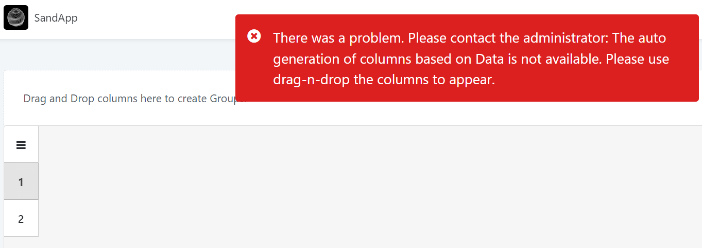
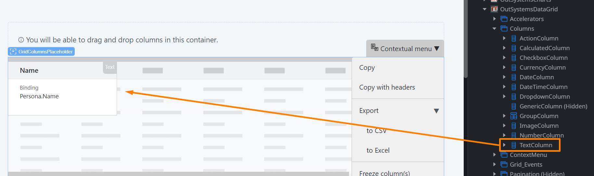
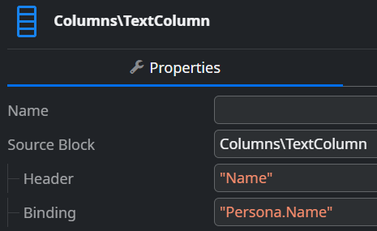
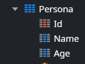

<h1>The auto generation of columns based on Data is not available</h1>

<h2>Precautions</h2>

This applies only to the ODC version of the OutSystems Data Grid.

<h2>Troubleshooting</h2>

When using the <a href="https://www.outsystems.com/forge/component-overview/15929/outsystems-data-grid-odc">OutSystems Data Grid</a> component, you may get this error in runtime: <code class="editorCode">The auto generation of columns based on Data is not available. Please use drag-n-drop the columns to appear.</code>

 

<h2>Incident Resolution Measures</h2>

<ol>
    <li>In order for the Data Grid component to load data, and thus avoid these errors, you must use the component's <strong>Column</strong> blocks; these are the blocks that must be dragged onto the columns placeholder: 
     
     
     </li>
    <li>We may then assign a title and the field to be displayed on that column by filling the <strong>Header </strong>and <strong>Binding </strong>attributes as follows: 
     
     
     </li>
    <li>For reference, in the above example, we used the <strong>Name</strong> attribute from a <strong>Persona </strong>entity: 
     
     
     </li>
</ol>

<h2>Additional context</h2>

<ul>
    <li>When developing Data Grid for ODC, it was not immediately possible to have the same auto-generation feature that O11 has due to limitations with the external logic. As such, it's not certain if or when auto-generation of columns will be added for Data Grid in ODC.</li>
</ul>
