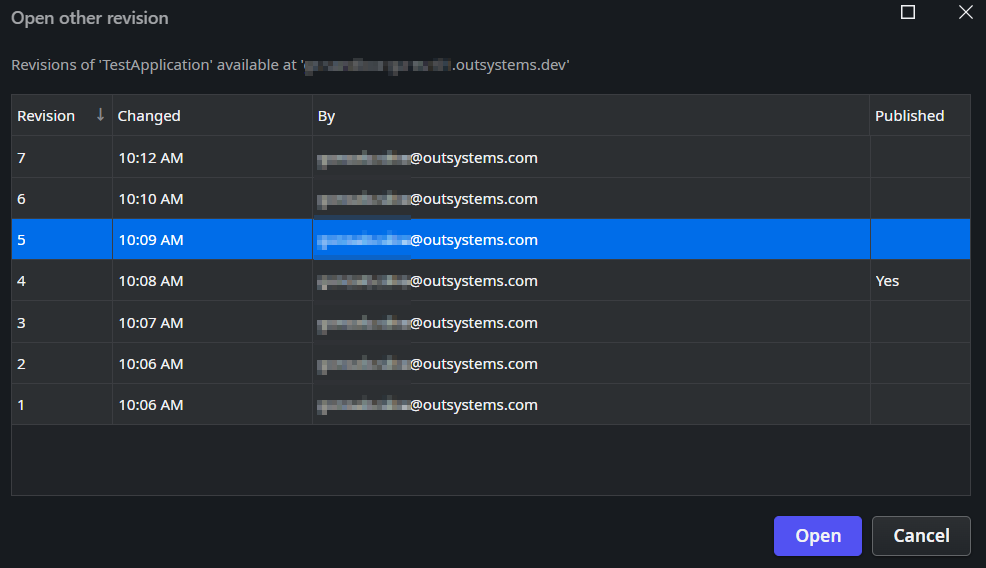
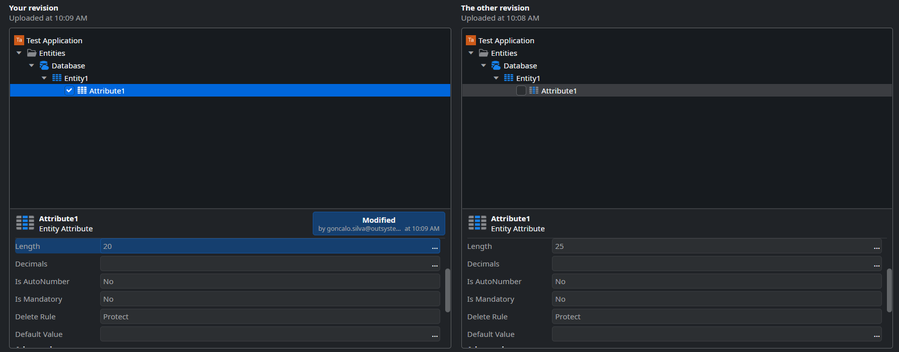

<h1>Unable to publish application because of error - value too long for type character</h1>

Error Code: OS-RDBE-GEN-50010, OS-DPL-50204 
<strong>Symptoms</strong>: value too long for type character, Publish Error in Service Studio, OS-RDBE-GEN-50010

<h2>Precautions</h2>

N/A

<h2>Troubleshooting</h2>

When publishing a specific application, you may be met with an error similar to the one below:

<code class="editorCode">An error has occurred while executing SQL scripts: SQL script execution error. value too long for type character varying(20) (OS-RDBE-GEN-50010)</code>

In this error, the value in parenthesis (20) may vary, but it is important for this issue. This error means that an Entity's record has a longer attribute value than that attribute's Length property should allow. In order to easily determine what's the attribute in question, select the "<strong>Open other revision</strong>..." option in ODC Studio and select the first revision that got this error; if you don't know which one it is, it will always be the first revision after the last successfully published revision, as in the example below:

Afterwards, use the "<strong>Compare and merge with another revision or file</strong>..." feature of ODC Studio and select the last successfully published revision, the one with "<strong>Yes</strong>" in the "<strong>Published</strong>" column (revision 4 in the example above). In this "Compare and Merge" window, look for changes in entity attributes. You should find an Entity Attribute Length property changed to the value in the error above (20 in this example):

<h2>Incident Resolution Measures</h2>

If you've been able to find the attribute(s) in question, then you've been able to confirm the cause of the issue above. As initially explained, this mean that the attributes above have records with lengths longer than the attribute's property allows. Knowing this, you have two options:

<ol>
    <li>Adjust the attribute's Length property back to its original value;</li>
    <li>Adjust the records in your entity so that they respect the Attribute Length.</li>
</ol>

If the error persists after you follow either/both of the steps above, please <a href="https://success.outsystems.com/support/home/">contact our Global Support team</a>.

