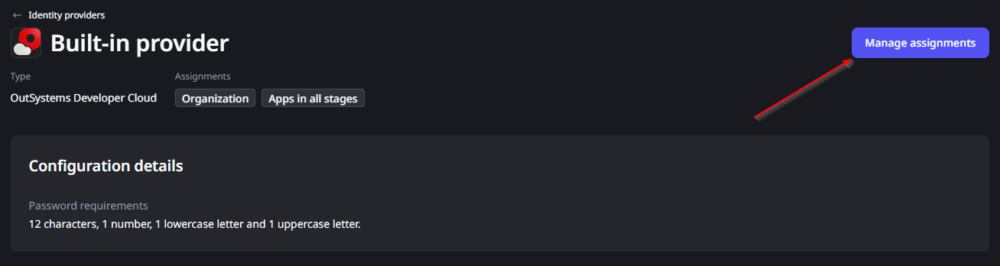
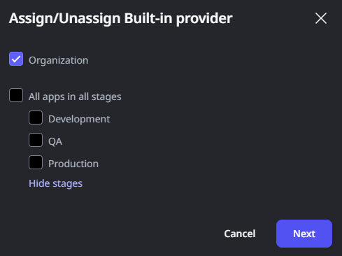

# Unable to log into ODC Portal due to issues with External Identity Provider

## Symptoms

Unexpected error when authenticating with an identity provider, Unable to authenticate in ODC Portal, ODC Portal is unavailable.

## Precautions<

This may occur when your External Identity Provider has an issue that prevents authentication from being successful, and the Built-In Provider is unassigned from Organization Access, both of which cause the ODC Portal to be inaccessible. The goal is not to solve the underlying problem with your IdP, but to mitigate the impact as much as possible by swiftly granting you access back to ODC Portal through the Built-In provider.

## Troubleshooting

When attempting to log into ODC Portal through an External Identity Provider, you may receive an error that prevents you from logging in successfully, such as the example below:

If an error like this occurs and you unassign Organization Access from the Built-in Provider, you may be completely locked out of your ODC Organization, with no way of recovering access autonomously. An example may be that your IdP's client secret expired before you updated it in your ODC Portal configuration.

## Incident Resolution Measures

If this happens, then you will need to contact our Global Support Team through the <a href="https://success.outsystems.com/support/home/">Support Portal</a>. Our team's immediate goal will be to reassign the Built-In Provider to Organization Access, allowing you to log back in with the built-in credentials. When you get in touch with us, please ensure we have your approval to perform these actions. For transparency, these will be the steps our team will take:

1. Open your ODC Portal, go to "Identity Providers" and select the **Built-in Provider**
1. Click **Manage assignments**.

    

1. Toggle the **Organization** access so that it is on.

    

1. Click **Confirm changes and logout**.

After doing this, the ODC Portal will be accessible through the Built-in credentials (if you don't recover your password, you also have the option to reset it). From there, you'll be able to work on the issue that caused your IdP to not work to begin with and then unassign the built-in provider once again if you prefer.

**Note**

If you require a password reset and do not receive the email, it's possible your user was created directly in your External Identity Provider; please use a user created in the Built-in provider (such as the original administrator).
