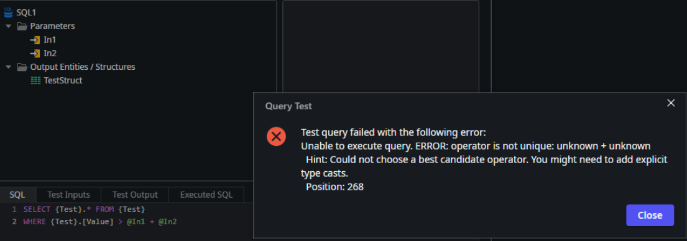
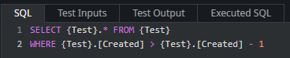
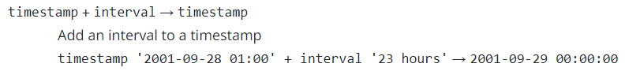
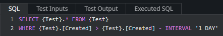
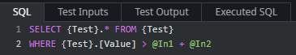
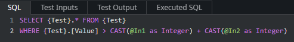

<h1>ERROR: operator does not exist / ERROR: operator is not unique in Advanced SQL</h1>

 

<h2>Troubleshooting</h2>

While testing an Advanced SQL query in ODC Studio, you may find the below errors:

<code class="editorCode">ERROR: operator does not exist: (...)</code>

<code class="editorCode">ERROR: operator is not unique: (...)</code>

 
Example below: 

<h2> </h2>

<h2>Incident Resolution Measures</h2>

For context, ODC uses <a href="https://www.postgresql.org/">PostgreSQL</a> as the underlying database provider.

This comes with some limitations inherent to the system, such as type conversion rules which can cause errors for Advanced SQL queries - being Advanced SQL queries, these are customized by developers and ODC Studio cannot take into account and protect against all potential error scenarios.

As such, these errors are direct results returned by the database, and can be resolved according to PostgreSQL rules. We'll explain how to resolve some of these scenarios below, as examples.

<h2> </h2>

<h2>Examples</h2>

<ul>
    <li>
    
<strong>ERROR: operator does not exist: timestamp with time zone - integer</strong> 
     
     
     
    This error can occur when using an operator between two types for which that operator does not exist. In the example above, <strong>Created</strong> is a <strong>Date Time</strong> type (ODC), which corresponds to a <em>timestamp with time zone</em> type in PostgreSQL. 
     
    According to official documentation <a href="https://www.postgresql.org/docs/current/functions-datetime.html" rel="noopener noreferrer" target="_blank">9.9. Date/Time Functions and Operators</a>, adding/subtracting from a <em>timestamp</em> type only works with the <em>interval</em><strong> </strong>type: 
     
     
     
    To resolve this, we may simply replace the <em>integer</em> with the corresponding <em>interval</em> cast, such as <code class="editorCode">INTERVAL '1 DAY'</code> for the example above: 
     
     
     

    </li>
    <li>
    
<strong>ERROR: operator is not unique: unknown + unknown</strong> 
     
     
     
    This error can occur when operators are used between <em>input parameters</em>. 
     
    Basically, Advanced SQL statements are first <strong>Prepared</strong>, in which <em>input parameters</em> are all replaced with <em>?</em>, and then <strong>Executed</strong> as a function, with a list of arguments to replace each <em>?</em> in order. 
     
    For the example above, we could imagine that, behind the scenes, the <strong>Prepared</strong> statement becomes something like this: 
     
    <code class="editorCode">SELECT {Test}.* FROM {Test} WHERE {Test}.[Value] &gt; ? + ?</code> 
     
    You can read more about this in the official documentation: <a href="https://www.postgresql.org/docs/current/ecpg-dynamic.html#ECPG-DYNAMIC-INPUT" rel="noopener noreferrer" target="_blank">36.5.2. Executing a Statement with Input Parameters</a> 
     
    The problem is that <em>?</em> is of unknown type, and thus result in the observed error <em>unknown + unknown</em>, because when the statement is <strong>Prepared</strong>, the data types are not clear and cannot be inferred from the context. 
     
    To solve this, we must explicitly cast the types of the input parameters, such as <code class="editorCode">CAST(@InputParameter as Integer)</code> for the example above: 
     
    

    </li>
</ul>
