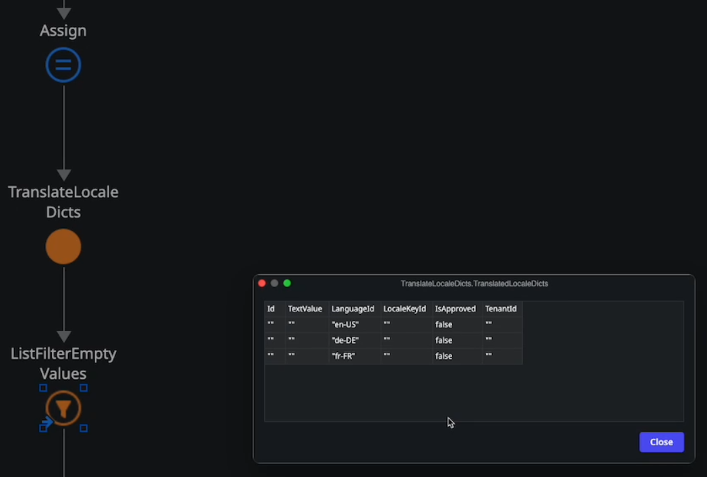

<h1>Debugger: Output values may have empty or false values when executing actions</h1>

 
Error Code: N/A 
 
<strong>Symptoms</strong>: boolean false, empty string, Output values having empty text or false values, compiler optimizer

<h2>Troubleshooting</h2>

 

You may found that, when debugging, your output parameters may have innacurate values (empty if they are text, false if boolean, or default date in case of date,1900-01-01):

<ul>
    <li></li>
</ul>

By contrast, you may notice that when you execute the same action in runtime (in the browser/mobile device), the values are all correct. If you can confirm this behavior, confirm in your logic if the output parameters are being used/assigned anywhere else in your application. If they <strong>are not</strong>, proceed to the section below.

 

<h2>Incident Resolution Measures</h2>

 

This is an expected situation when output parameters are not being used anywhere else. This is done in order to optimize performance in the debugger and save the amount of data we transfer Server-to-client when running an application, so only information that is truly necessary will show up in the debugger.

The optimization works for:

<ul>
    <li>
    
Screen Aggregates

    </li>
    <li>
    
Data Actions

    </li>
    <li>
    
Server Actions in the logic of the client-side Screen Actions

    </li>
</ul>
