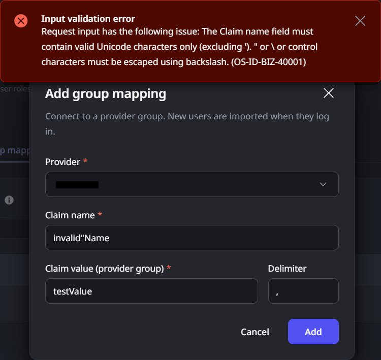

<h1>OS-ID-BIZ-40001</h1>
<h2>Error message</h2>

Input validation error

Request input has the following issue: The Claim name field must contain valid Unicode characters only (excluding '). " or \ or control characters must be escaped using backslash.

Request input has the following issue: The Claim value field must contain valid Unicode characters only (excluding '). " or \ or control characters must be escaped using backslash.

Request input has the following issue: The Delimiter field must contain valid Unicode characters only (excluding '). " or \ or control characters must be escaped using backslash.

Request input has the following issue: The Claim value field cannot contain the delimiter.

<h2>Cause</h2>

When configuring <a href="https://success.outsystems.com/documentation/outsystems_developer_cloud/user_management/configure_authentication_with_external_identity_providers/idp_and_end_user_group_mapping/">end-user group mapping</a>, the "Claim name", "Claim value" or "Delimiter" fields include unsupported characters or the "Claim value " field contains the chosen delimiter.

<h2>Impact</h2>

This will prevent the creation of Group Mapping for your external Identity Provider.

<h2>Recommended action</h2>

Ensure that you only use supported characters. All unicode characters are allowed, except for the single quote ('). The full list of characters requiring backslash escaping is:

<ul>
    <li id="isPasted">double-quotes</li>
    <li>backslash</li>
    <li>backspace</li>
    <li>formfeed</li>
    <li>linefeed</li>
    <li>carriage return</li>
    <li>horizontal tab</li>
</ul>

Additionally, ensure that the "Claim value" field does not contain the value in the delimiter field.

<h2>More info</h2>

For more information about setting up the claim in Microsoft Entra ID (formerly known as Azure AD), <a href="https://learn.microsoft.com/en-us/azure/active-directory/hybrid/connect/how-to-connect-fed-group-claims" rel="noopener noreferrer" target="_blank">click here</a>. For more information about setting up the claim in OKTA, <a href="https://help.okta.com/asa/en-us/content/topics/adv_server_access/docs/group-management.htm" rel="noopener noreferrer" target="_blank">click here</a>.

