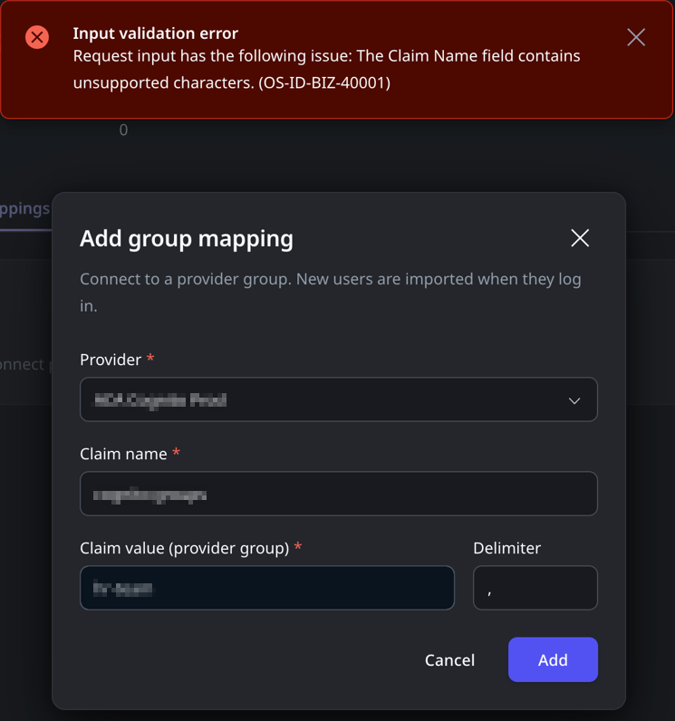

<h1>OS-ID-BIZ-40001</h1>
<h2>Error message</h2>

Input validation error

Request input has the following issue: The Claim Name field contains unsupported characters.

Request input has the following issue: The Claim Name field starts with unsupported characters.

<h2>Cause</h2>

When configuring <a href="https://success.outsystems.com/documentation/outsystems_developer_cloud/user_management/configure_authentication_with_external_identity_providers/idp_and_end_user_group_mapping/">end-user group mapping</a>, the "Claim Name" field includes unsupported characters.

<h2>Impact</h2>

This will prevent the creation of Group Mapping for your external Identity Provider.

<h2>Recommended action</h2>

Ensure that you only use supported characters. As a general guideline, these are the supported characters:

<ul>
    <li id="isPasted">Lowercase letters: a-z (e.g., a, b, c, ..., z)</li>
    <li>Uppercase letters: A-Z (e.g., A, B, C, ..., Z)</li>
    <li>Digits: 0-9 </li>
    <li>The following special characters:<ul>
    <li>Dot: .</li>
    <li>Underscore: _</li>
    <li>Hyphen (dash): -</li>
    <li>Tilde: ~</li>
    <li>Plus sign: +</li>
    <li>Forward slash: /</li>
    <li>Colon: :</li>
</ul>
</li>
</ul>
<h2>More info</h2>

For more information about setting up the claim in Microsoft Entra ID (formerly known as Azure AD), <a href="https://learn.microsoft.com/en-us/azure/active-directory/hybrid/connect/how-to-connect-fed-group-claims" rel="noopener noreferrer" target="_blank">click here</a>. For more information about setting up the claim in OKTA, <a href="https://help.okta.com/asa/en-us/content/topics/adv_server_access/docs/group-management.htm" rel="noopener noreferrer" target="_blank">click here</a>.
