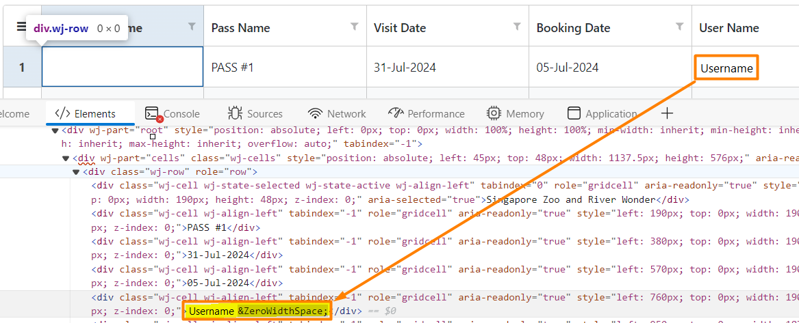

<h1>ZeroWidthSpace found in user name when inspecting HTML</h1>

<h2>Precautions</h2>

This occurs only when displaying the name of a user retrieved from an external identity provider without a last name.

<h2>Troubleshooting</h2>

When inspecting a particular user's name in an app's HTML code, the following special character <strong>&amp;ZeroWidthSpace </strong>is shown as below:

<h2>Incident Resolution Measures</h2>

The <a href="https://en.wikipedia.org/wiki/Zero-width_space">Zero-width space special character</a> is a <strong>non-printing character</strong> used in computerized typesetting to indicate word boundaries to text-processing systems for scripts that do not use explicit spacing, or after characters not followed by a visible space after which there may be a line break.

<ul>
    <li>Basically it helps in defining boundaries for line breaks in languages where spaces are not used to delimit words, e.g. Japanese.</li>
</ul>

 

For users retrieved from external identity providers, this character is used as a <strong>placeholder</strong> character when the user's name is a single word - no last name provided.

<ul>
<li>Verify whether the <strong>Name</strong> claim you have configured for your identity provider gets a full name (e.g. <strong>name</strong> claim), and not just a first or last name (e.g. <strong>given_name</strong> or <strong>family_name</strong>).

    <ul>
        <li>From OIDC standards: <a href="https://openid.net/specs/openid-connect-core-1_0.html#StandardClaims">https://openid.net/specs/openid-connect-core-1_0.html#StandardClaims</a> </li>
    </ul>
    </li>
    <li>In any case, this doesn't cause any direct impact, though it may potentially affect third-party Javascript libraries if they do not handle this gracefully.</li>
</ul>
