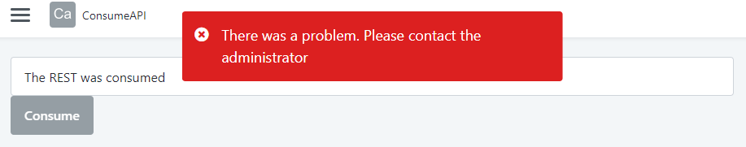

<h1>Consuming another application's REST API results in an error when IP Filter is activated</h1>

Error Code: 
<strong>Symptoms</strong>: OS-BERT-00000, Unable to consume REST API, REST API Returning 403 Forbidden

<h2>Precautions</h2>

N/A

<h2>Troubleshooting</h2>

You may have a scenario where an application is <a href="https://success.outsystems.com/documentation/outsystems_developer_cloud/integration_with_external_systems/consume_rest_apis/">Consuming a REST API</a> that is <a href="https://success.outsystems.com/documentation/outsystems_developer_cloud/integration_with_external_systems/exposing_rest_apis/expose_a_rest_api/">exposed by another application</a> successfully. However, after <a href="https://success.outsystems.com/documentation/outsystems_developer_cloud/managing_outsystems_platform_and_apps/configure_ip_filters/">configuring IP Filters</a>, you may find that you will run into an error such as the one below:

In your logs, you will find the following error message: <code class="editorCode">OS-BERT-00000 - 403 Forbidden</code>

If you deactivate your IP Filters, the API will likely be consumed successfully. If this is the behavior you're experiencing, then the cause of this is by design.

The function to consume/expose REST APIs was primarily designed to communicate with other systems outside an ODC Organization. As such, due to design, the request to consume the REST API is treated as if coming from an external source and not from within the ODC Organization, which is why it is blocked by IP Filtering.

<h2>Incident Resolution Measures</h2>

If you have a scenario where it is truly necessary to consume an API exposed by another application in your Organization, you can go around this fairly easily by implementing the following changes:

<ul>
    <li>Create a Service Action inside the application exposing the REST API;</li>
    <li>Consume the REST API inside this Service Action;</li>
    <li>Reference the Service Action inside the Application(s) where you need to consume the REST API.</li>
</ul>

With this implementation, the request to consume the API will come from within the application exposing it, and you'll be able to reference it in other applications while keeping IP Filters active.

<em>(Note: Service Actions cannot be referenced from a Library, so the customer will need to expose the API in an application)</em>

