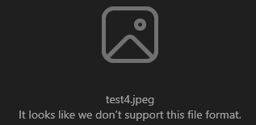
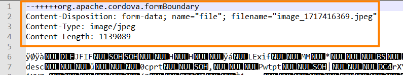
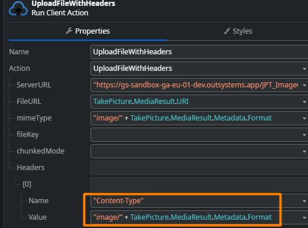

<h1>File Transfer Plugin UploadFile action corrupts image files</h1>

<h2>Precautions</h2>

This only applies when the <a href="https://success.outsystems.com/documentation/outsystems_developer_cloud/integration_with_external_systems/mobile_plugins/file_transfer_plugin/">File Transfer Plugin</a> is used.

Affects both iOS and Android apps.

<h2>Troubleshooting</h2>

Basically, image files uploaded with the <strong>UploadFile</strong> action from the <strong>File Transfer Plugin</strong> become corrupted if we then try to download and open them - they simply will not open, such as below:

 

To confirm this, we can open the image file with Notepad and check whether it has metadata added at the top, instead of just binary content:

 

 

Further confirmation can be achieved by removing these lines from the top while still using the notepad - after removal, the image should now open as expected.

<h2>Incident Resolution Measures</h2>

Now, this is the expected behavior of the <strong>File Transfer Plugin</strong>, as per the plugin's <a href="https://github.com/search?q=repo%3Aapache%2Fcordova-plugin-file-transfer%20multipartFormUpload&amp;type=code">source code</a> from Cordova.

Nevertheless, <a href="https://stackoverflow.com/questions/31175836/cordova-file-transfer-remove-multipart-or-content-disposition-header" rel="noopener noreferrer">from this online thread</a>, a suggestion is to include a dummy header so it does not add any metadata to the file - again, based on the source code itself.

There is a simple way to do this, which is to replace the <strong>UploadFile</strong> action with the <strong>UploadFileWithHeaders</strong> action, also from the same plugin, and setting a dummy header such as Content-Type, for example: 
 

This then does not add any metadata to image files, and thus does not corrupt them.

