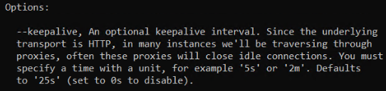

<h1>Cloud Connector client error - close 1006 abnormal closure</h1>

<h2>Troubleshooting</h2>

When verbose logs are enabled for the Cloud Connector client, one may see the below error occasionally:

<code class="editorCode">client: Connection error: websocket: close 1006 (abnormal closure): unexpected EOF</code>

The Cloud Connector client works by opening and keeping network tunnels open even when there are no requests going through at a given time.

Sometimes, other network components such as <strong>proxies</strong> or <strong>firewalls</strong> may arbitrarily close these idle connections, resulting in the observed errors.

Typically, these errors are quickly resolved as the client automatically and imediately attempts to reconnect, as can be seen in the below examples:

<code class="editorCode">2024/03/22 05:28:30 client: tun: SSH disconnected 
2024/03/22 05:28:30 client: Disconnected 
2024/03/22 05:28:30 client: Connection error: websocket: close 1006 (abnormal closure): unexpected EOF 
2024/03/22 05:28:30 client: Retrying in 100ms... 
2024/03/22 05:28:31 client: Handshaking... 
2024/03/22 05:28:31 client: Sending config 2024/03/22 05:28:31 client: Connected (Latency 17.595289ms) 
2024/03/22 05:28:31 client: tun: SSH connected</code>

<h2>Incident Resolution Measures</h2>

While any operations that rely on a Secure Gateway connection should be fault-tolerant in the first place, as we cannot predict or control every aspect of such these network routes, there are other potential actions that can be taken in order to reduce or prevent these closures from occurring:

<ul>
<li>

Adding the <code class="editorCode">--keepalive</code> flag to prevent these idle connections being seen as inactive, which is also mentioned in the <code class="editorCode">--help</code> section of the component (<a href="https://github.com/OutSystems/cloud-connector/?tab=readme-ov-file#4--detailed-options-top-">here</a>):

<ul>
<li>

Example: <code class="editorCode">./outsystemscc --v --header "token: &lt;token&gt;" --keepalive 20s &lt;servers&gt;</code>

</li>
<li>

Note that the above <code class="editorCode">20s</code> value is just an example and can be changed as needed.

</li>
</ul>
</li>
<li>

Inspecting any firewall or other proxy logs for any connection closures during the affected times.

</li>
<li>

In a test scenario, removing any firewall or proxy from the Cloud Connector client's route to validate whether the errors stop occurring or not, thus narrowing down the origin of the connection closures.

</li>
</ul>
