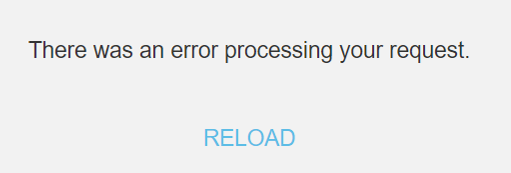

<h1>Unable to load applications due to a RequireJS Script Error</h1>

 

Error Code: OS-CRLT-RJS-00001

<strong>Symptoms</strong>: Script error for "@outsystems/runtime-core-js", Mobile application redirects to "There was an error processing your request" screen, Blank screen when loading an app, Script error for OutSystems/ClientRuntime, OS-CLRT-RJS-00000, OS-CLRT-RJS-00001, OS-CLRT-RJS-00002, "There was an error processing your request" in traditional/reactive applications

<h2>Precautions</h2>

The error described in this Incident Model is an expected consequence of a recent transition to a modern JavaScript bundler. For more information on this transition, refer to the following thread in our public forums: <a href="https://ODC - Transitioning from RequireJS to modern JavaScript Bundler" target="_blank" rel="noopener noreferrer">ODC - Transitioning from RequireJS to modern JavaScript Bundler</a>.

 
<h2>Troubleshooting</h2>

When opening any application, the customer may be met with a generic error:

<code class="editorCode">There was an error processing your request</code>

It is also possible that your application simply loads a blank screen, or your login logic may also remain loading indefinitely. If you experience these behaviors, open your browser's console and check if you find an error similar to the examples below:

<code class="editorCode">Error: Script error for "OutSystems/ClientRuntime/&lt;internal_module&gt;" https://requirejs.org/docs/errors.html#scripterror</code>

<code class="editorCode">Uncaught Error: Script error for "@outsystems/runtime-core-js"</code>

<code class="editorCode">https://requirejs.org./docs/errors.html#scripterror </code>

 

If you find these errors, then you may be certain that it is related to the transition described above, and you can proceed to <strong>Incident Resolution Measures</strong>. If you get the initial symptoms above without an error referring to requirejs, then please look for other Incident Models or, if necessary, <a href="https://success.outsystems.com/support/home/" target="_blank" rel="noopener noreferrer">contact our Global Support</a>.

<h2>Incident Resolution Measures</h2>

The error indicates very explicitly that there is a portion of your application still using requireJS, which is no longer supported in ODC. As such, the first and easiest recommendation is to ensure that any popular Forge Components you're using have been updated to the minimum required version. Here are some examples:

<ul><li>Ultimate PDF: version 1.1.8 or above</li>
<li>SEO Utils on Steroids: 0.2.0 or above</li>
<li>Droppable File Upload: 0.1.5 or above</li>
<li>CKEditor 5: 0.2.0 or above</li></ul>

If you are using any of these components and they're below the versions described above, then updating them will be a necessary action, and potentially the only one.

If the issue persists after you've updated the components above, then it's possible that some other component is still using requireJS, so you'll need to confirm in your producers if this may be the case. If you have any custom Javascript nodes in your client-side logic, you may also need to adjust it, we recommend you use our <a href="https://success.outsystems.com/documentation/outsystems_developer_cloud/outsystems_language_and_elements/outsystems_apis/javascript_api/" target="_blank" rel="noopener noreferrer">JavaScript API</a>.

For convenience, here's an example of a piece of code that may no longer be supported, along with a suggested alternative below:

<table border="1" cellpadding="1" cellspacing="1"><tbody><tr><td>
<em>var Public = require("OutSystems/ClientRuntime/Public");</em>

<em>if (Public.ApplicationLifecycle.isUpgradingVersion()){</em>

<em>    // Your code</em>

<em>}</em>
</td></tr></tbody></table><table border="1" cellpadding="1" cellspacing="1"><tbody><tr><td>
<em>if ($public.ApplicationLifecycle.isUpgradingVersion()){ </em>

<em>    // Your code </em>

<em>}</em>
</td></tr></tbody></table>
