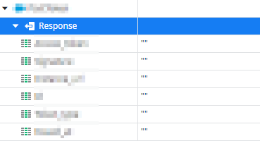
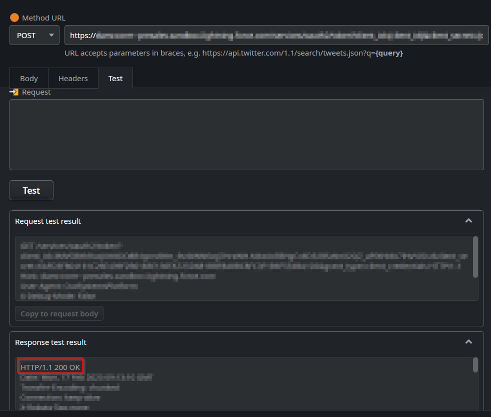
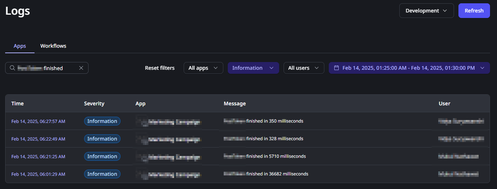
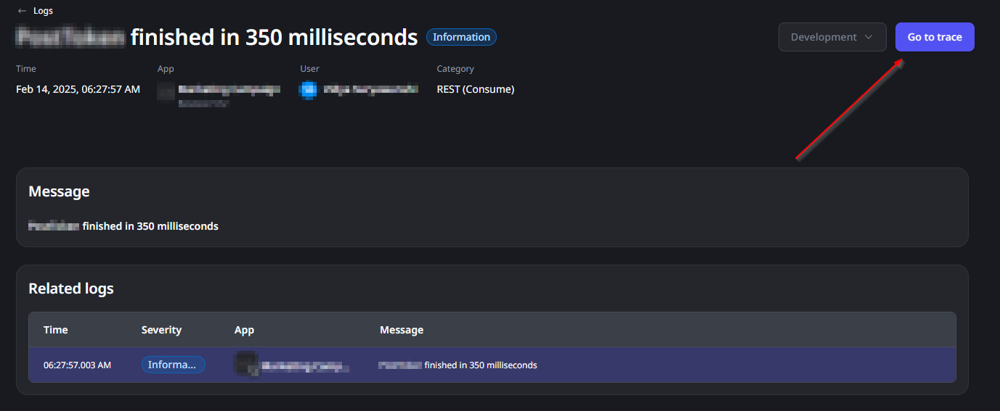
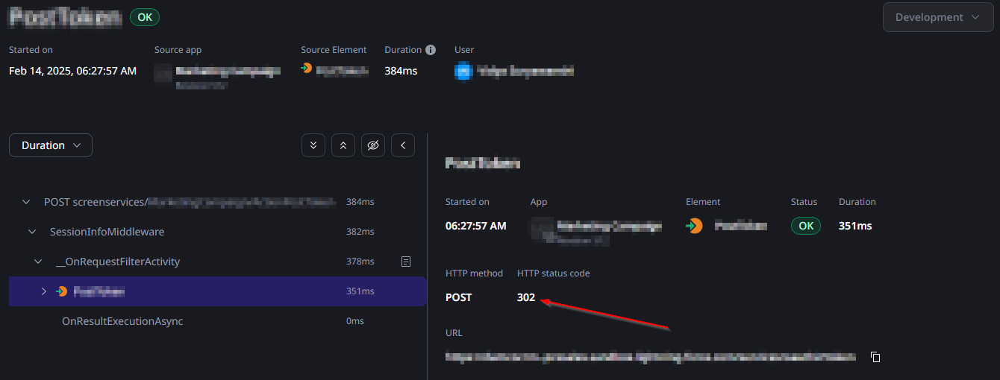

<h1>Consuming a REST API via HTTP returns empty values</h1>

<strong>Symptoms</strong>: HTTP 302/Redirect, Issue Consuming REST API, Output values having empty text or false values

<h2>Troubleshooting</h2>

When <a href="https://success.outsystems.com/documentation/outsystems_developer_cloud/integration_with_external_systems/consume_rest_apis/" target="_blank" rel="noopener noreferrer">consuming REST APIs</a>, you may notice that the response body is coming back with empty results, even when the response is otherwise successful; you may notice that this occurs both in Runtime and even when debugging the API response, where you'll confirm that the body of the response is empty:

In your investigation, you may confirm that, when calling the API over HTTPS, you get a "200 OK" response:

If this occurs, please access the logs of your ODC Portal, make sure you enable the "Information" Logs and look for entries called "[API Endpoint] finished", where "API Endpoint" is the name of the API Method in ODC Studio, like in the example below:

Open any of the logs you find with this message, and then click in the "Go to trace" button:

When checking the Trace, select your Method and check if the "HTTP status code" is 302:

If you can confirm that the HTTP Status Code is 302, please proceed to Incident Resolution Measures. Otherwise, this Incident Model may not be applicable for you.

<h2>Incident Resolution Measures</h2>

This behavior is caused by an API redirecting a request from HTTP to HTTPS or vice-versa; this tends to happen in situations like the ones below:

<ul>
    <li>The API is private and it has a self-signed certificate. This is a more likely scenario when you are consuming a REST API via the <a href="https://success.outsystems.com/documentation/outsystems_developer_cloud/managing_outsystems_platform_and_apps/configure_a_private_gateway_to_your_network/" target="_blank" rel="noopener noreferrer">Private Gateway</a> through HTTP and then redirect it to HTTPS. This may also occur with public APIs. </li>
</ul>

The underlying cause is that the redirection from HTTP to HTTPS causes the API to not be successfully consumed for security reasons given that a HTTP to HTTPS redirection is occurring. In this situation, there are two recommendations you can make:

<ul>
    <li>Ensure that your API can be consumed through the HTTPS Protocol; please keep in mind that ODC does not support self-signed certificates and that the REST API must have a valid public certificate with a public certificate authority to ensure the request is accepted, either at the client or server side.</li>
    <li>Alternatively, and depending on the purpose of the API, you may consider disabling this redirect and accept the request in HTTP; please consider all security consequences of this before deciding this to be your course of action.</li>
</ul>
