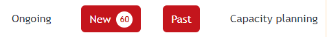
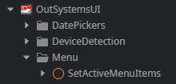
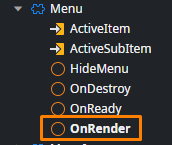
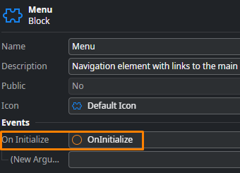

<h1>Multiple menu items active at the same time</h1>

Affects the default <strong>Menu</strong> block from a new app's template and OutSystems UI menu action <strong>SetActiveMenuItems</strong>.

Multiple menu items may appear active/selected when only a single item is expected to be active, such as below:

<h3>Cause</h3>

Typically, setting the active menu item is done via the <strong>SetActiveMenuItems</strong> action from OutSystems UI &gt; Menu.

By default, this action is called in the <strong>OnRender</strong> event handler of the default <strong>Menu</strong> block from an app's template:

By design, to ensure a smooth transition between screens, there is a short period where both screen's DOM is loaded.

Thus, when transitioning between screens (and thus selecting different menu items), some <a href="https://success.outsystems.com/documentation/11/building_apps/application_logic/screen_and_block_lifecycle_events/">screen lifecycle events</a> from different screens may overlap if we change screens a bit too fast. For example:

<ol>
<li>You have screens A, B, and C.</li>
<li>You start in screen A.</li>
<li>You select screen B via the menu block, and very quickly select also screen C before screen B finishes loading.</li>
</ol>

This can lead to <strong>OnRender/OnReady</strong> events being called for screen B while screen C is already loading, and screen B hasn't yet been destroyed. 

Ultimately, this may result in multiple menu items active at the same time, that of the previous and current screens (B and C, respectively).

<h3>Solution</h3>

Since users can have different flows or behaviors, the solution is to move the <strong>SetActiveMenuItems</strong> action to the <strong>OnInitialize</strong> event handler of the <strong>Menu</strong> block instead.

Since the <strong>OnInitialize</strong> event is fired before actually navigating to a screen and starting to fetch data, this ensures no overlap of this event between screens.

