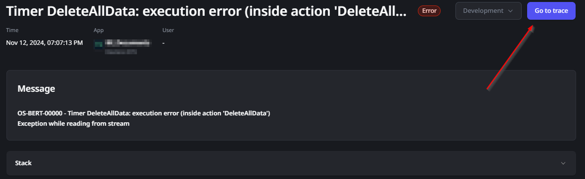
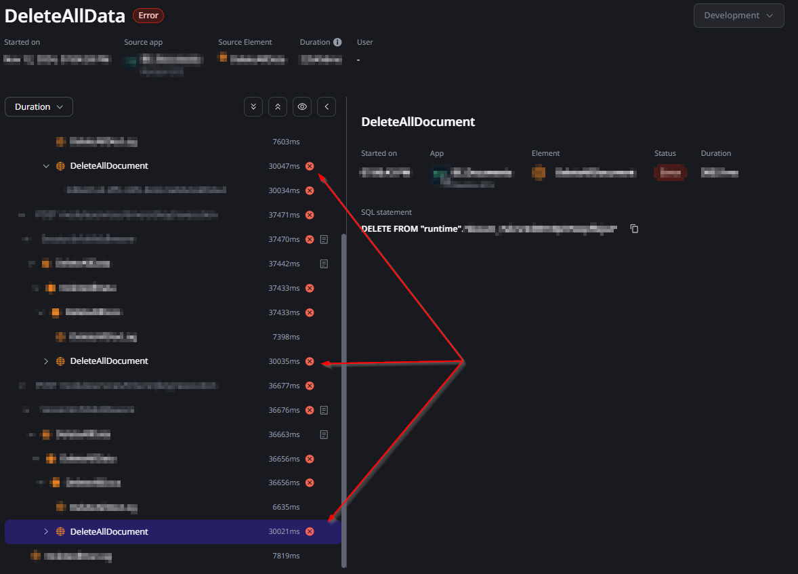
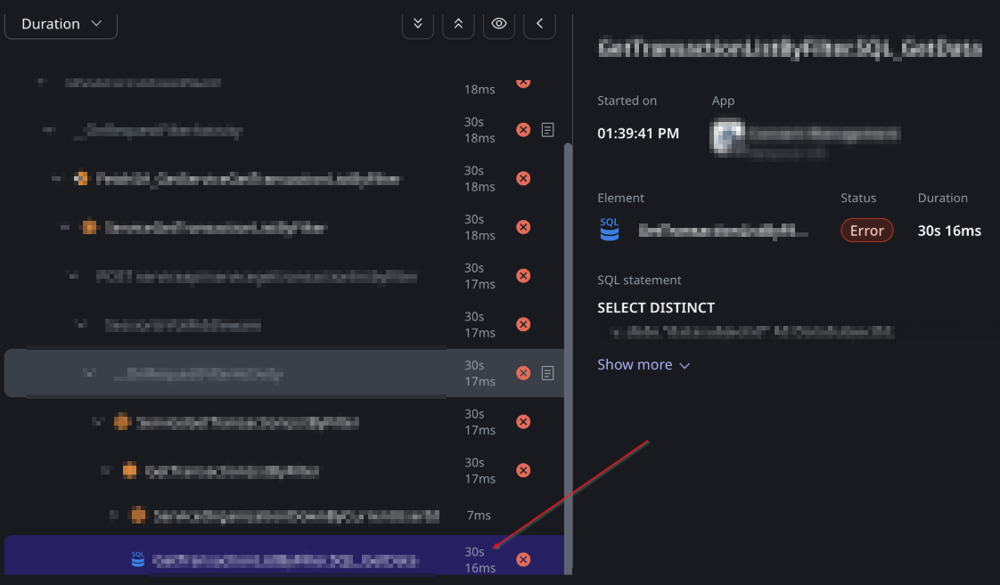
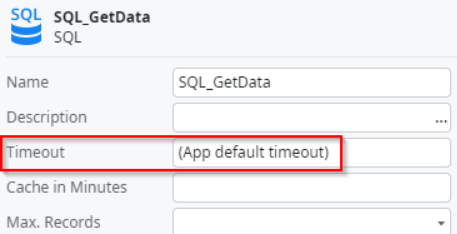
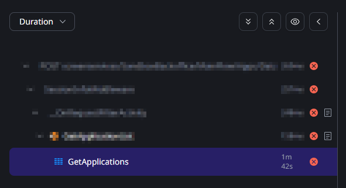
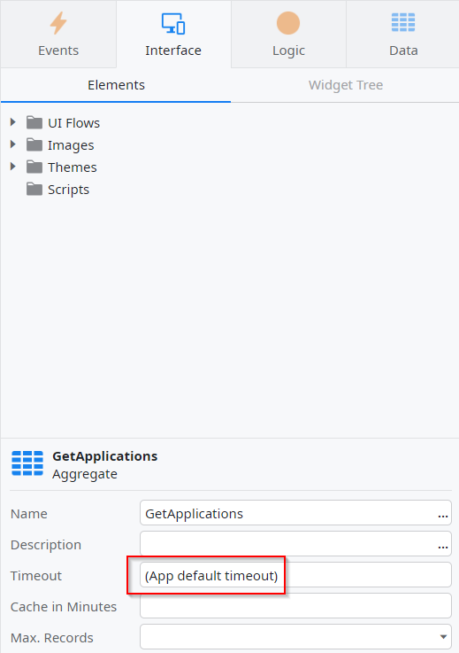

<h1>Error - Exception while reading from stream</h1>

Error Code: OS-BERT-60407, OS-BERT-00000, OS-TMR-50000

<strong>Symptoms</strong>: Exception while reading from stream, Exception of type 'System.Net.Http.HttpRequestException' was thrown, Error in advanced query

<h2>Troubleshooting</h2>

When executing a server-side action, such as a Timer or a Data Action, you may notice an error similar to the ones below:

<code>
Error in advanced query XYZ in XYZ in XYZ (query...) Exception while reading from stream
</code>

<code id="isPasted">Timer XYZ: execution error (inside action 'XYZ') Exception while reading from stream</code>

This error will usually be a surface symptom of an underlying issue occurring somewhere within its logic. Once you see this error, click on "Go to Trace" to look further into where this is coming from:

When inside the trace, expand the spans with errors (indicated by a red cross) until you find the lowest possible one. From here, this Incident Model will describe some currently known scenarios:
<ul>
<li>
<strong>Scenario 1: </strong>Entity Actions failing at 30s;</li>
<li>
<strong>Scenario 2: </strong>SQL Nodes failing at a consistent mark (usually 30s);</li>
<li>
<strong>Scenario 3: </strong>Aggregates failing at a consistent mark (usually 1m42s).</li>
</ul>
            
<strong>Scenario 1: Entity Actions failing at 30s</strong>
        
You will possibly find that the error is originating from Entity Actions that are throwing an error at around the 30000 ms mark like in the example below:
        

        
If you find this in the Traces, then the cause is clear and you can proceed to Incident Resolution Measures.

<strong>Scenario 2: </strong>
<strong>SQL Nodes failing at a consistent mark (usually 30s)</strong>
        
You will possibly find that the error is originating from an advanced SQL at around the 30s mark:
        

        
If you find this in the Traces, then the next step is to open this application in ODC Studio and find this exact SQL Node; by following the steps of the Trace, you'll be able to reach it.
Once you reach this SQL Node, click on it and confirm if its "<strong>Timeout</strong>" property is set to "(App default timeout)", like in the screenshot below:
        

        
If you can confirm that the timeout is set to the default, then the cause is clear and you can proceed to Incident Resolution Measures.
        
<strong>Note: </strong>If it has a non-default value (eg.: 45 seconds) and the error is occurring in that SQL node at that exact mark (45s in this case), you can still proceed to Incident Resolution Measures with the same assumption.
        
<strong>Scenario 3: Aggregates failing at a consistent mark (usually 1m42s)</strong>
    
You will possibly find that traces include Aggregates that are failing at exactly 1m42s, like in the example below:
    

    
If you find this in the Traces, then the next step is to open this application in ODC Studio and find this exact aggregate; by following the steps of the Trace, you'll be able to reach it.
Once you reach this aggregate, click on it and confirm if its "<strong>Timeout</strong>" property is set to "(App default timeout)", like in the screenshot below:
    

    
If you can confirm that the timeout is set to the default, then the cause is clear and you can proceed to Incident Resolution Measures.
    
<strong>Note: </strong>If it has a non-default value, such as 40, check if the aggregate is failing at a mark that is equal to the following calculation: (timeout value) * 3 + 12 

<ul>
<li>Example with a default timeout value: 30*3 + 12 = 102. This is equal to 1m 42s.</li>
<li>Example with a 40s timeout value: 40*3 + 12 = 132. This is equal to 2m 12s.</li>
</ul>

If it does match this value, you can still proceed to Incident Resolution Measures, and this calculation will be explained there.

<h2>Incident Resolution Measures</h2>

<strong>Scenario 1: Entity Actions failing at 30s</strong>
    
The cause for these errors is that Entity Actions have a fixed timeout value of 30 seconds on their execution. This error is more prone to occur in the <strong>DeleteAll</strong> and <strong>CreateOrUpdateSome </strong>Entity Actions as these will usually take longer to execute.
Because this timeout is fixed, your only option will be to find a way to ensure the Entity Action completes in under 30 seconds; a suggestion is to perform it in a looped bulk with the Commit Transaction server action.

<strong>Scenario 2: SQL Nodes failing at a consistent mark (usually 30s)</strong>
    
Similar to scenario 1, this is caused by a timeout applied to SQL Nodes, which have a default timeout of <strong>30 seconds</strong>. If this SQL Node has a custom timeout value and the error is occurring at that specific mark, then the cause is identical.
In these situations, the solution may include increasing the Timeout value, though be careful that this may not always be the best approach. You may instead consider finding ways to make the SQL Node execute more quickly instead.

<strong>Scenario 3: Aggregates failing at a consistent mark (usually 1m42s)</strong>
    
This one is essentially identical to Scenario 2, as Server aggregates also have a default timeout of <strong>30 seconds</strong> (this does not necessarily apply to screen aggregates). However, there is a key difference, in that when server aggregates hit their timeout, there's an internal retry mechanism that executes the aggregate 2 more times with a backoff time of 3 seconds and then 9 seconds. As such:

<ol>
<li>The aggregate fails to execute in 30 seconds;
<ul>
<li>There's a 3s backoff before the 2nd attempt;</li>
</ul>
</li>
<li>The aggregate fails to execute in 30 seconds;
<ul>
<li>There's a 9s backoff before the 3rd attempt;</li>
</ul>
</li>
<li>The aggregate fails to execute in 30 seconds.
<ul>
<li>There are no more retries.</li>
</ul>
</li>
</ol>

This adds up to exactly 102 seconds, or 1m42s, which explains why the aggregate fails consistently at this mark if the aggregate has a default timeout.
As such, if you identify this pattern, the solution is the same as in scenario 2; you may consider increasing the timeout value of the aggregate in question or find a way for it to execute in a shorter amount of time than its currently defined timeout.
