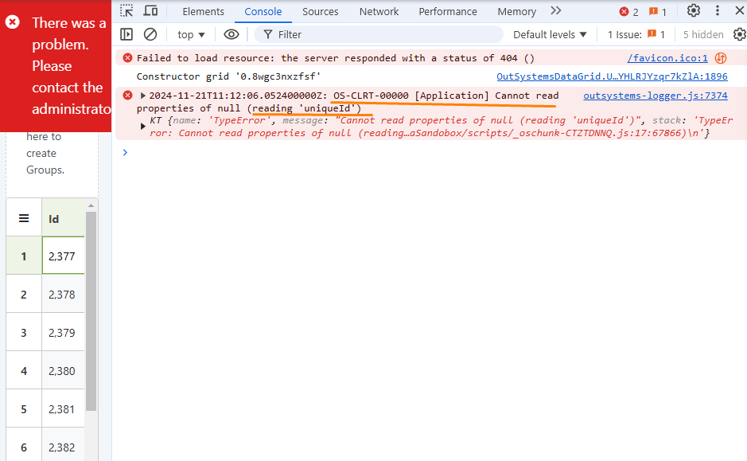
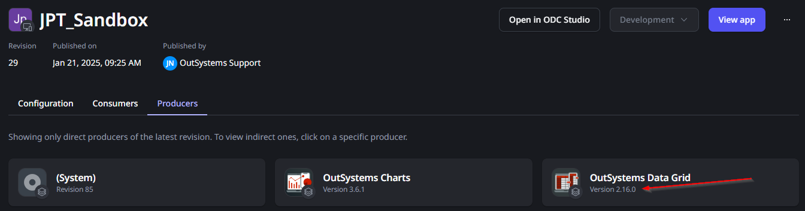

<h1>Error reading a null uniqueId when using Data Grid</h1>

Error Code: OS-CLRT-0000

<strong>Symptoms</strong>: OS-CLRT-00000, DataGrid runtime error when loading, Cannot read properties of null, Client side error "Cannot read properties of null", OS-CLRT-00000 \[Application\] this is null.

<h2>Troubleshooting</h2>

While loading a screen that has a <a href="https://www.outsystems.com/forge/component-overview/15929/outsystems-data-grid-odc">Data Grid</a> block in it, you may receive a red error banner stating "There was a problem. Please contact the administrator". If you open your browser's console, you may find one of the following errors depending on the browser:
<ul>
<li><strong>Chrome</strong>: OS-CLRT-00000 \[Application\] Cannot read properties of null (reading 'uniqueId')</li>
</ul>

<ul>
<li><strong>Firefox</strong>: OS-CLRT-00000 \[Application\] this is null</li>
</ul>

![Firefox console showing error: OS-CLRT-00000 [Application] this is null](images/im-image-ck-2025123gqN9O8el0kxaoluU7yvXXSouiA3B3pw1k125jLRntU.png "Firefox Console Error")

If you see either of these errors in this situation, the next step is to confirm the version of your OutSystems Data Grid component; to do this, open your main application in ODC Portal (the one where you see the error above) and open the list of producers. Confirm if Data Grid is <strong>below version 2.17.1</strong>, as in the screenshot below:
          

If you can confirm this, proceed to Incident Resolution Measures below. Otherwise, continue your investigation and, if necessary, <a href="https://success.outsystems.com/support/home/">contact our Support team</a> as this article should not be related to your issue.

<h2>Incident Resolution Measures</h2>

This error is a consequence of a change to how Javascript code is loaded overall, and is fixed in version<strong> 2.17.1</strong> of OutSystems Data Grid: ROU-11187 - Improved overall JavaScript code compatibility with the usage of strict mode.

As such, in order to resolve this issue, you will need to update your OutSystems Data Grid to version 2.17.1 or above. Note that, after updating it, you'll also need to ensure that your application is also consuming the new version, as described in this article: <a href="https://success.outsystems.com/documentation/outsystems_developer_cloud/building_apps/libraries/#update-consumers">Decide if to consume a new version of a library in your app or library</a>.
