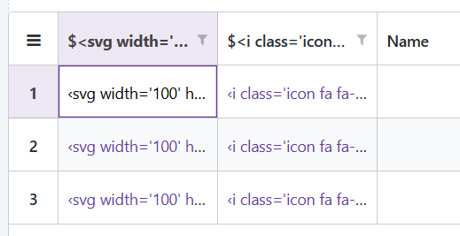
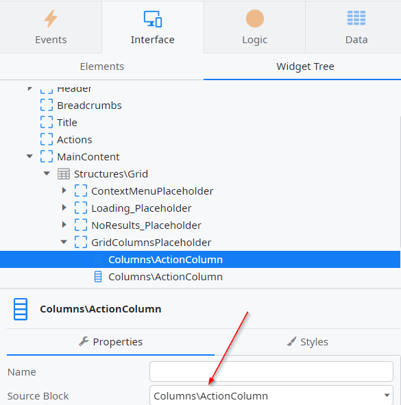
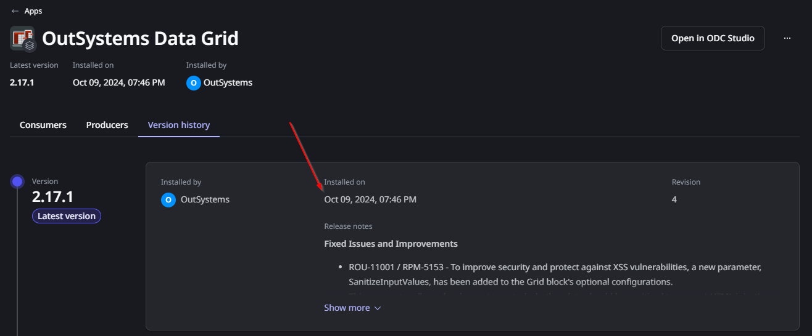
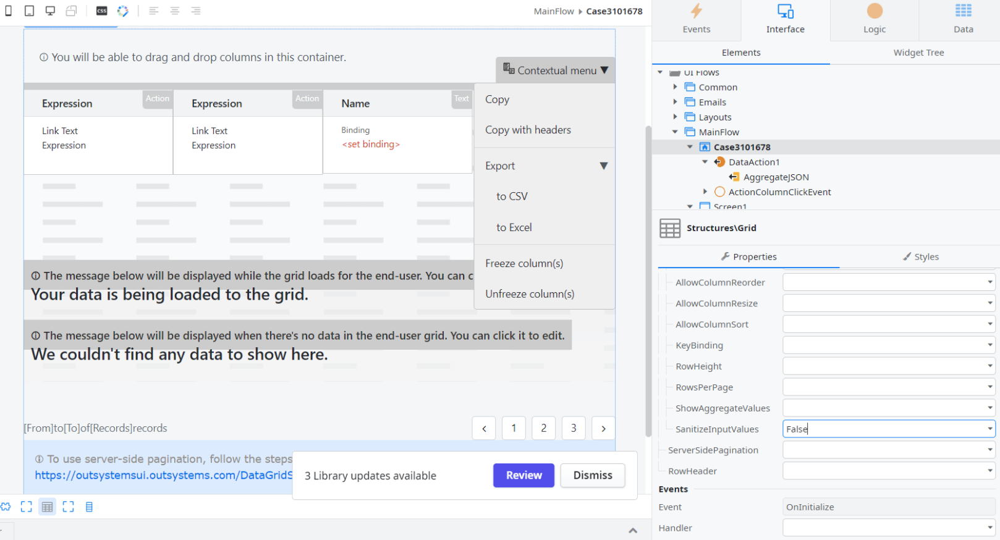
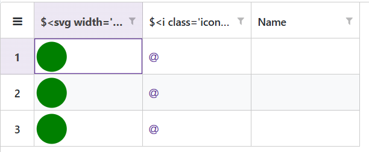

<h1>Icons are no longer visible in Data Grid columns after updating the component</h1>

<strong>Symptoms</strong>: Icons not showing up in Data Grid, Data Grid issue.

<h2>Precautions</h2>

This Incident Model describes an intended consequence of a security fix implemented in version 2.17.1 of <a href="https://www.outsystems.com/forge/component-overview/15929/outsystems-data-grid-odc">OutSystems Data Grid</a> (RPM-5153/ROU-11001).

<h2>Troubleshooting</h2>

After updating Data Grid, you may notice that some of its columns are showing HTML instead of the intended icons. The screenshot below shows an example of this:

If this is the case, you should check what kind of column you're using; it's probably using an ActionColumn, ImageColumn or ContextMenu. You can do this by finding the grid in ODC Studio and looking at the Widget Tree to find the "SourceBlock" in question:

After you confirm this, the next step is to ensure if your Data Grid component is on <strong>version 2.17.1 or higher</strong>. You can confirm this, for example, by checking when you published this version, which you can find in the component's "version history" in ODC Portal. In the example below, we can see it was installed on October 9th, 2024:

If you've been able to confirm this, you may proceed to the Incident Resolution Measures.

<h2>Incident Resolution Measures</h2>

As described in the precautions, this is an intended consequence, and in fact it is listed as a <strong>Breaking Change in version 2.17.1:</strong> To improve security and protect against XSS vulnerabilities, a new parameter, SanitizeInputValues, has been added to the Grid block's optional configurations. This parameter allows developers to control whether data should be sanitized to prevent HTML injection, particularly in column blocks like the ActionColumn, ImageColumn, and ContextMenu.

The default value for SanitizeInputValues is set to True, ensuring that HTML content is automatically sanitized out of the box, prioritizing security.

As the release notes describe, you can deactivate the <strong>SanitizeInputValue</strong> property in the "Structures\Grid" Widget (under "OptionalConfigs") if you believe that being open to this vulnerability is an acceptable risk. 
The screenshot below shows how to do this:

After doing this, you'll likely see that the icons show up correctly as they did before:

