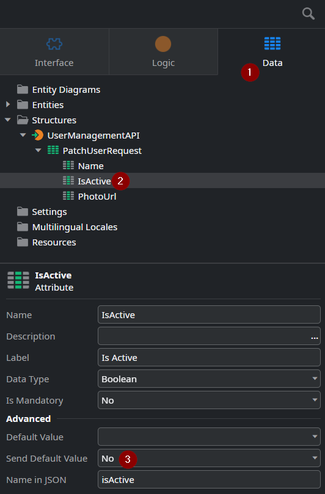
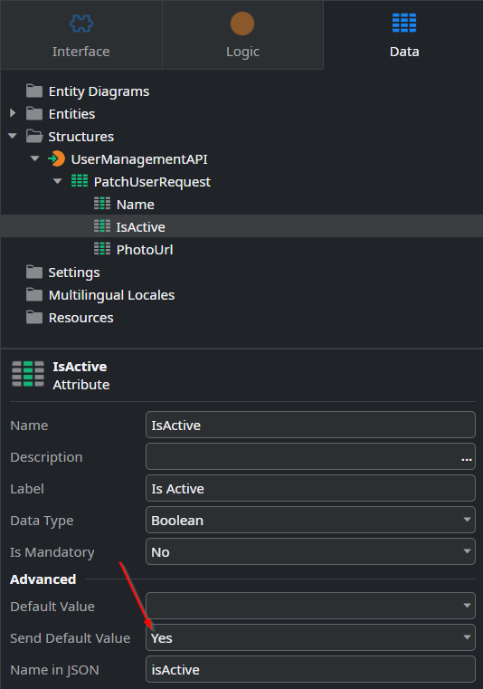

<h1>ODC API Patch User does not set users to inactive</h1>

<strong>Symptoms</strong>: User does not become inactive, Issue related to the User and Access Management APIs, Patch User method does not work

<h2>Precautions</h2>

The explanation shared in this Incident Model may impact other methods with a request body that you are consuming in ODC, it is not limited to the <a href="http://success.outsystems.com/documentation/outsystems_developer_cloud/outsystems_language_and_elements/outsystems_apis/odc_rest_apis/user_and_access_management_api/#patch-/users/-key-">User &amp; Access Management API's Patch Users</a> method.

<h2>Troubleshooting</h2>

When consuming the <a href="https://success.outsystems.com/documentation/outsystems_developer_cloud/outsystems_language_and_elements/outsystems_apis/odc_rest_apis/user_and_access_management_api/#patch-/users/-key-" target="_blank" rel="noopener noreferrer">Patch users</a> method in ODC's User &amp; Access Management API in your own OutSystems application, you may notice that you are unable to set a user to Inactive, even though the method is seemingly successful. Normally, the "<strong>isActive</strong>" attribute should be able to set a user to Active/Inactive depending on its value (True/False respectively).

From testing this method, you may notice the following pattern:
<ul>
<li>The method works when changing a user's name or photoUrl;</li>
<li>The method sets a user to inactive successfully when you call it from an external client (such as Postman);</li>
<li>When you call this method from your ODC application, it can successfully set a User to active, but it cannot set a user to inactive, even when you receive a successful status (204).</li>
</ul>

If your scenario doesn't match the pattern above (eg.: you are getting 400/401/404 responses, or you are unable to change other attributes with this method), then this Incident Model does not apply. Ensure the method is being called correctly and, if in doubt, consider asking other developers in our community, or contact our Support team.

If your scenario matches the pattern detailed above, then open the application/library in ODC Studio where you are calling this method. Open the "Data" tab and find the Structure under your API that matches the Patch User method. By default, it's called "<strong>PatchUserRequest</strong>". Confirm if the "Send Default Value" of the "isActive" property is set to "No":
    

    
If you can confirm this, proceed to Incident Resolution Measures.
If the property is set to "Yes" and you still cannot set a user to Inactive with it, please contact our Support team for further help.
     
<h2>Incident Resolution Measures</h2>
     
To resolve this, simply change the "<strong>Send Default Value</strong>"<strong> </strong>of the "isActive" attribute to "<strong>Yes</strong>":
    

The reason this works comes down to the way OutSystems handles REST APIs; when you call an API method that has a request body (usually a Patch or Post method), a JSON is sent, and the request body includes the attributes in question. The "Send Default Value" property determines if a particular attribute is included in the request when its value corresponds to the attribute's default value (in the field immediately above). If you have not determined a default value in the field above, then the default values for that data type will apply.

As such, because "isActive" is a boolean attribute, and booleans have a default value of "False" (<a href="https://success.outsystems.com/documentation/outsystems_developer_cloud/building_apps/data_management/data_types_and_conversions/" target="_blank" rel="noopener noreferrer">Data types</a>), this effectively means that this attribute is not included in the request at all when you set a user to inactive; this explains why it works when setting them to active, and why other attributes are unaffected. By changing "send default value" to "Yes", then the request will include attributes with default values, allowing the "isActive" attribute to be included in the request with its default "False" value.
