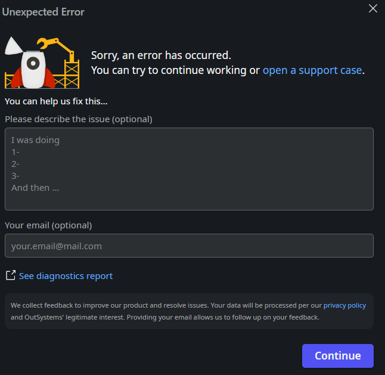

<h1>Unable to export translations in Excel File - ODC Studio crash</h1>

<strong>Symptoms</strong>: Method not found, ODC Studio Crash, Unable to export multilanguage file in ODC Studio, Unable to translate application in ODC Studio

<h2>Precautions</h2>

This Incident Model is describing an issue introduced in <a href="https://success.outsystems.com/support/release_notes/outsystems_developer_cloud_releases/odc_studio/#odc_studio_1.5.8" target="_blank" rel="noopener noreferrer">ODC Studio 1.5.8</a>.

<h2>Troubleshooting</h2>

When choosing to <a href="https://success.outsystems.com/documentation/outsystems_developer_cloud/building_apps/multilingual_apps/translation_management/#export-the-text-for-translation" target="_blank" rel="noopener noreferrer">export the text of your application to an Excel file</a> to translate it, you may notice that ODC Studio does not react after you select the target folder; in some situations, ODC Studio may even throw an unexpected error as in the screenshot below:

If you run into this issue and you can confirm that your ODC Studio version is 1.5.8 or above, please proceed to the incident resolution measures.

<h2>Incident Resolution Measures</h2>

We have identified the cause of this issue, and are currently working on fixing it; this fix is associated with Problem Record RPM-5607, and you'll be able to confirm in the <a href="https://success.outsystems.com/support/release_notes/outsystems_developer_cloud_releases/odc_studio/" target="_blank" rel="noopener noreferrer">ODC Studio Release Notes</a> when this issue is resolved.

If you run into this error, for the timebeing we recommend using the <a href="https://success.outsystems.com/documentation/outsystems_developer_cloud/building_apps/multilingual_apps/translating_with_the_translation_editor/" target="_blank" rel="noopener noreferrer">ODC Studio Translation Editor</a>, which is unaffected by this issue.

If you have a specific scenario requiring you to export the language resources (eg.: you need your app to be translated by an external party with no access to ODC Studio), please <a href="https://success.outsystems.com/support/home/" target="_blank" rel="noopener noreferrer">contact our Global Support</a> team and explain that you are affected by RPM-5607 so that they may supply you with an alternative ahead of the resolution of this issue.

