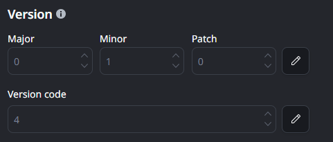
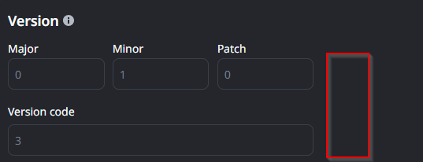

<h1>Mobile App version is not editable in Test Stages</h1>

 

<strong>Symptoms</strong>: Unable to modify the version of a mobile package in Test Stages

<h2>Troubleshooting</h2>

When you are <a href="https://success.outsystems.com/documentation/outsystems_developer_cloud/building_apps/mobile_apps/create_mobile_app_package/" target="_blank" rel="noopener noreferrer">creating a mobile app package</a>, ODC will suggest the application's version number (Major, Minor, Patch) as well as the Version Code, which is a number that increments by one every time MABS generates a new package. Both of these values are editable in the Development and Production stages:

What you may notice is that, when you try to edit this value in a Test Stage, the option to edit these values is missing:

If this is the behavior you're running into, proceed to Incident Resolution Measures.

<h2>Incident Resolution Measures</h2>

This behavior is expected by our versioning mechanism; when you are creating a mobile package in a Test Stage, the mechanism automatically suggests a version number. If you have no packages generated in the Production Stage, then the default suggestion for Test Stages is 0.1.0.

On the other hand, if you have already created packages in your Production Stage, then the suggestion will always increment on top of that. As an example:

<ul>
    <li data-start="721" data-end="1049">If the current Production package is 0.1.0, the next suggested version in the Test Stage will be 0.1.1;</li>
    <li data-start="971" data-end="1049">If the current Production package is 1.0.0, the next suggested version in the Test Stage will be 1.0.1.</li>
</ul>

These version values are exclusively used for Tracking purposes, since builds in a Test Stage should not be production-ready; on the other hand, builds in Production may be expected to be released in app stores, so proper version control is necessary there.
