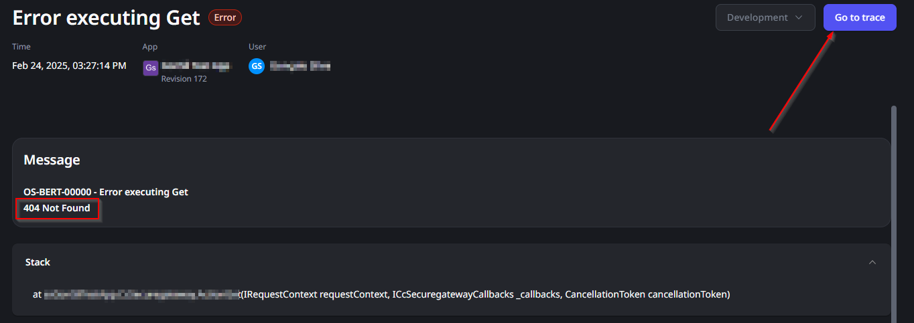
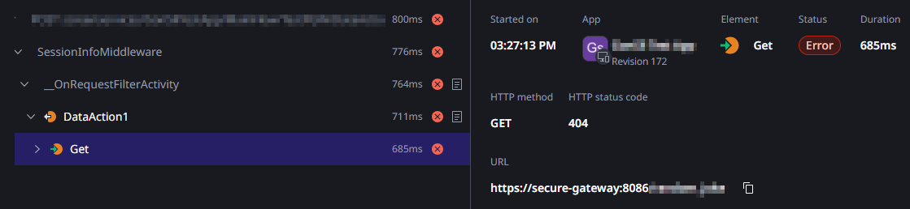
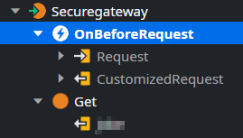
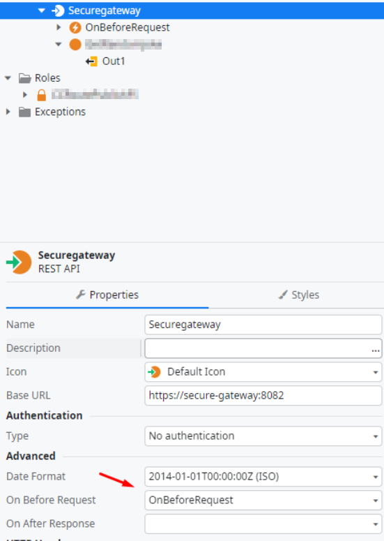
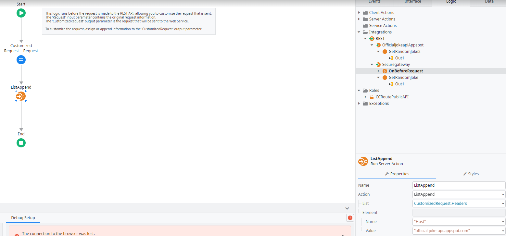

<h1>Consuming an API from the Private Gateway results in a "404 not found" Response</h1>

 

Error Code: OS-BERT-00000

 

<strong>Symptoms</strong>: 404 Error - Not Found, Unable to consume REST API

<h2>Precautions</h2>

This error covers a relatively specific but common scenario where consuming an API via the Private Gateway results in a "404 not found" response, but it is not meant to be a comprehensive list of the potential causes for this error.

 

<h2>Troubleshooting</h2>

You may notice that, when you <a href="https://success.outsystems.com/documentation/outsystems_developer_cloud/managing_outsystems_platform_and_apps/configure_a_private_gateway_to_your_network/#use-endpoints-in-your-apps" target="_blank" rel="noopener noreferrer">consume an API through the Private Gateway</a>, the method will return a "404 Not Found" reponse, similar to the example below. If so, you can also check the Traces to ensure this response is coming from the API you are consuming:

There may be multiple causes for this error, including an issue in the API you are consuming or connection issues from your Cloud Connector. That said, if you are getting the error above, please open the app/library where you are consuming this API in ODC Studio and confirm if you have an "OnBeforeRequest" API Callback on it like in the screenshot below:

If you do not have this Callback, proceed to Incident Resolution Measures; if you do, you may still proceed to Incident Resolution Measures to confirm if it has the logic we'll suggest in the section below.

<h2>Incident Resolution Measures</h2>

As implied in the Troubleshooting section, it's possible that the error is caused by a lack of "OnBeforeRequest" API Callback; the reason for this is that, for many APIs, they require their own URL to be in the Header of the request when you try to consume them. The issue with this is that, in ODC Studio, the "URL" that the request is going to is "secure-gateway:[port]", which may cause the API to reject the request.

By adding an OnBeforeRequest, you can edit the header to specifically include the API's URL in the "Host" value as required; the value should be the api's hostname (which you probably used in the command to execute <a href="https://github.com/OutSystems/cloud-connector" target="_blank" rel="noopener noreferrer">Cloud Connector</a>). As such, perform these actions:

<ul>
    <li>Add a new Action OnBeforeRequest:<ul>
    <li>
        
        </li>
    </ul>
</li>
<li>Drag the Server Action <strong>ListAppend </strong>to the OnBeforeRequest's logic before the End and set its parameters as follows:<ul>
<li>
    
List: CustomizedRequest.Headers

</li>
<li>
    
Element.Name: "Host"

</li>
<li>
    
Element.Value: "[API URL]"

</li>
<li>
    

    
    

</li>
</ul>
</li>
</ul>

If you already have an OnBeforeRequest with other necessary logic, just ensure it includes this as well.

If you are still running into the same response after performing these steps, please confirm if all the information is correct, including the API's URL and the connection through Cloud Connector; if everything looks correct and the issue still persists, please <a href="https://success.outsystems.com/support/home/" target="_blank" rel="noopener noreferrer">contact our Global Support team</a>.
