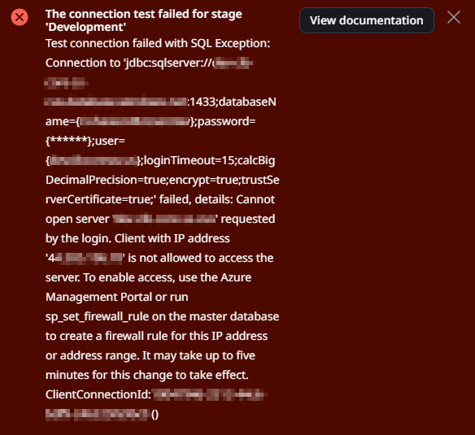
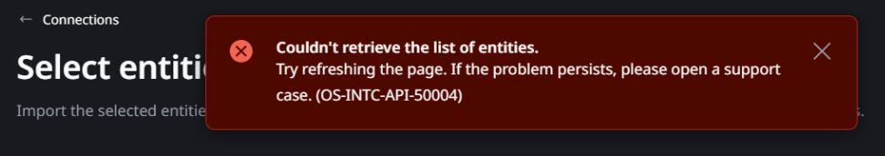
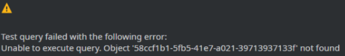

<h1>IP address is not allowed to access the server in External Databases</h1>

 

Error Code: OS-INTC-API-50004

<strong>Symptoms</strong>: Errors related to External Database connections, Unable to create external database connection, Client is not allowed access to the server, OS-INTC-API-50004

<h2>Precautions</h2>

While the principles of this incident model apply to all external connections, the error message used to illustrate this is specific to Azure SQL Databases in ODC.

<h2>Troubleshooting</h2>

While attempting to connect to an external database, you may run into the error below:

The most important part of the error are the error details:

<code>Details: Cannot open server 'database-server' requested by the login. Client with IP address '[IP]' is not allowed to access the server. To enable access, use the Azure Management Portal or run `sp_set_firewall_rule` on the master database to create a firewall rule for this IP address or address range. It may take up to five minutes for this change to take effect. 
</code>

This error is most likely to occur when you're trying to set up a connection.

It's also possible that this error occurs after you have already successfully configured a connection. After trying to refresh your database's list of entities or view one of these entities in ODC Studio, you may get the errors **OS-INTC-API-50004 - Couldn't retrieve list of entities** or **Object 'connection-id' not found** respectively.

If you are running into these errors and, when testing the connection, you can confirm that you received the message about the IP address not being allowed in the server, proceed to incident resolution measures.

<h2>Incident Resolution Measures</h2>

As the error indicates, the cause of this is that the IP address is not allowed on the server, in this case, the Azure SQL Database. If your external database requires IP whitelisting, then the connection will not be possible, and this error occurs. 

The reason why this may work temporarily is because you whitelisted IP addresses you had detected before. However, ODC stages do not have dedicated, static IP addresses or ranges. They are bound to rotate at any point, so it's not a viable solution to try whitelisting any range or IP at all.

If your external database requires some form of whitelisting, OutSystems recommends that you <a href="https://success.outsystems.com/documentation/outsystems_developer_cloud/managing_outsystems_platform_and_apps/configure_a_private_gateway_to_your_network/" target="_blank" rel="noopener noreferrer" id="isPasted">use a private gateway</a> to create this connection. By doing it this way, you'll have full control of the IP address of your Cloud Connector server, and you can use that IP address to build the connection to your external database.

