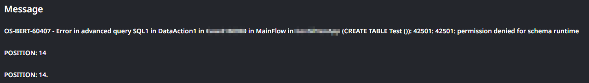
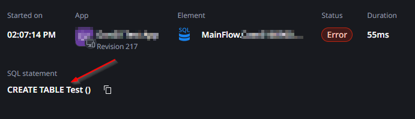

<h1>Error executing query due to permission denied</h1>

 

Error Code: OS-BERT-60407

 

<strong>Symptoms</strong>: 42501: permission denied for schema runtime, Error in advanced query, OS-BERT-60407

<h2>Troubleshooting</h2>

When executing an <a href="https://success.outsystems.com/documentation/outsystems_developer_cloud/building_apps/data_management/fetch_data_from_the_database_in_outsystems/query_data_using_sql/" target="_blank" rel="noopener noreferrer">advanced SQL Query</a>, you may notice that you receive an error similar to the one below

<pre id="isPasted">
    <code>OS-BERT-60407 - Error in advanced query (.....) 42501: 42501: permission denied for schema runtime 
     POSITION: 14</code>
</pre>

Here's a concrete example:

The "Position" is the character in the query where the error was triggered. It may be a different number than 14.

Once you know the position, open the Trace associated with the log and highlight the SQL Query so you can copy it. It's recommended that you use a notepad to find the character position more easily.

Once you confirm the position of the error, you may determine that it is the position immediately after a specific command. In the example below, position 14 matches "CREATE TABLE":

 Once you've confirmed the command that caused the error from its position, proceed to Incident Resolution Measure.

 

<h2>Incident Resolution Measures</h2>

If you are getting this error, it is likely that the command itself is not permitted. The runtime user that executes these statements only has permissions for DML (Data Manipulation Language) commands, which mainly amount to the following four:

<ul>
    <li>
        
SELECT:

        <ul>
            <li>
                
This command is used to retrieve data from one or more entities.

            </li>
        </ul>
    </li>
    <li>
        
INSERT:

        <ul>
            <li>
                
This command is used to add new records in an entity.

            </li>
        </ul>
    </li>
    <li>
        
UPDATE:

        <ul>
            <li>
                
This command is used to modify existing records in an entity.

            </li>
        </ul>
    </li>
    <li>
        
DELETE:

        <ul>
            <li>
                
This command is used to remove existing record data from an entity.

            </li>
        </ul>
    </li>
</ul>

Other commands may not result in the error above, so if you identify that your query is running into an error and you're using a different command, this is likely the reason why. If you happen to identify that this error is occurring in the position of one of the four commands above, then this is not expected, so please <a href="https://success.outsystems.com/support/home/" target="_blank" rel="noopener noreferrer">contact our Global Support team</a>.

