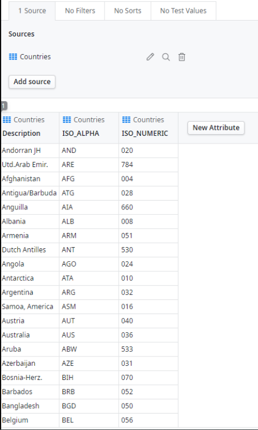
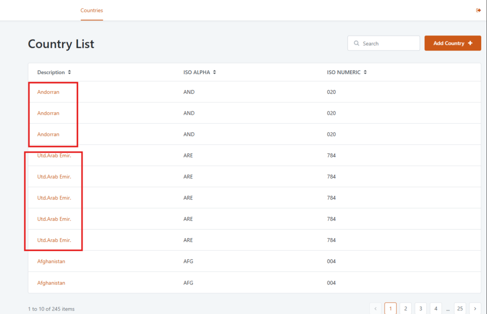
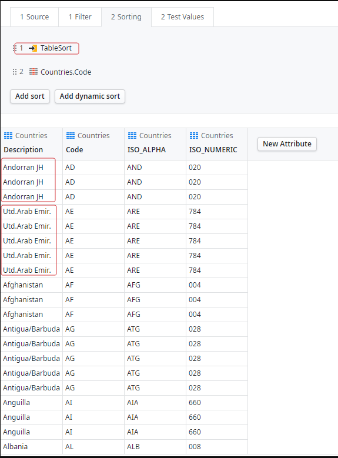
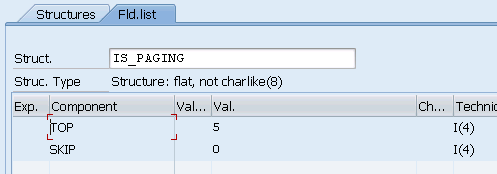

<h1>SAP OData duplicate records</h1>

 

 

<strong>Symptoms</strong>: Records from the external SAP OData connection are duplicated, triplicated, etc.

<h2>Troubleshooting</h2>

When retrieving records from a SAP OData external connection to a table, for example, records will appear normal in ODC Studio, and when opening on the Web application, duplicate records can be seen.

ODC Studio: 

 

Web Application Runtime:

This occurs because when an aggregate/entity is open in ODC Studio, it will not apply a sorting by default, and there is a display limit of 20. The rest of the records are truncated. On the Web Application, it will apply the sorting immediately by default, and then the duplicate values will be visible.

If a "Sort" is applied, you will be able to confirm that there are indeed duplicate records.

 

 

<h2>Incident Resolution Measures</h2>

This behavior is related to the SAP Server, the evidence indicates that the SAP Server has pagination disabled, and that's why this error is occurring.

This can be double-checked by testing the service in Postman with pagination. If you get the full set of records, that means that the server is ignoring the top and the offset. This can even be tested with different values and see if the result is always the same.

Integrating with an SAP Server that does not have server-side pagination support is not going to work with ODC, because the pagination in ODC requires the SAP server to support pagination as well.

Pagination enabled should look something like the image above, instead of 5, it should be the number of records you want per page. 
More information: https://abapskill.com/odata/paging-in-odata-service-top-skip-part-6/

