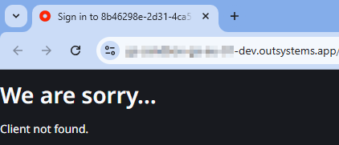
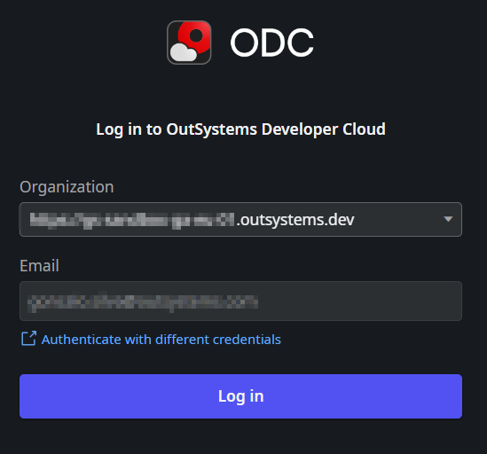

<h1>Error logging into ODC Studio Client not found</h1>

<strong>Symptoms</strong>: Unable to login ODC Studio, Client not found

<h2>Troubleshooting</h2>

When attempting to connect ODC Studio to your organization, you may run into an error similar to the one below:

When this happens, confirm that the domain you placed in the "Organization" field has the following format like in the example above: "[prefix]-dev.outsystems.app". If that is the case, please proceed to Incident Resolution Measures.

<h2>Incident Resolution Measures</h2>

To resolve this issue, ensure that the domain you paste in the "Organization" field of ODC Portal is the same you use for ODC Portal, which is always "[prefix].outsystems.dev".

