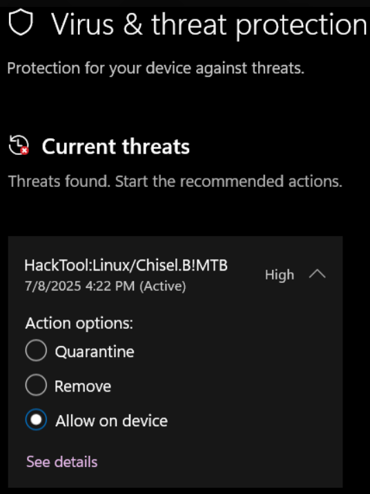

<h1>Outsystems Cloud Connector flagged as potentially malicious</h1>

 

 

<strong>Symptoms</strong>: Microsoft Defender blocking outsystemscc, Cloud Connector flagged as potentially malicious

<h2>Troubleshooting</h2>

When downloading OutSystems <a href="https://github.com/OutSystems/cloud-connector" target="_blank" rel="noopener noreferrer">Cloud Connector</a> (outsystemscc), you may receive an error that Microsoft Defender is blocking it due to being classified as a hacktool:

Other security vendors may also label Cloud Connector as potentially malicious.

 

<h2>Incident Resolution Measures</h2>

The main reason it is flagged as potentially malicious is due to Cloud Connector being a dual-use tool. While it's legitimate for tunneling and red team activities, it’s also commonly used by attackers for covert access, bypassing firewalls, or exfiltrating data. These types of tools may be labeled as "HackTools" or "Backdoors", not because it's malware by itself, but because of its potential misuse in real-world attacks.
Cloud Connector is used in OutSystems as a secure and efficient tool to enable the Private Gateway feature. Cloud Connector is also open source precisely to provide transparency and trust, and because of that we consider this to be a false positive.
As such, it is safe for Cloud Connector to be downloaded and installed. If you are technically blocked by a specific software such as Microsoft Defender, you may access your Computer's "Virus &amp; Thread protection settings", scroll down to exceptions and add outsystemscc as an exception. More information can be found in <a href="https://support.microsoft.com/en-us/windows/virus-and-threat-protection-in-the-windows-security-app-1362f4cd-d71a-b52a-0b66-c2820032b65e#bkmk_threat-protection-settings" target="_blank" rel="noopener noreferrer">this Microsoft Defender article</a>.
