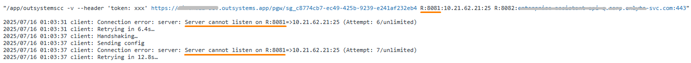

<h1>Cloud Connector - Server cannot listen on R:&lt;port&gt;... (multiple Cloud Connector instances)</h1>

<h2>Precautions</h2>

This article focuses on multiple Cloud Connector instances trying to establish a tunnel on the same port, which can lead to this error. However, it does not entirely rule out other potential issues.

<h2>Context</h2>

When launching the [Cloud Connector](https://github.com/OutSystems/cloud-connector), it connects to the [private gateway](https://www.outsystems.com/tk/redirect?g=9a023d82-da5b-4164-8f3f-9d6c35444b50) server running on the OutSystems side. It then establishes one or more tunnels with the provided settings in the below format:

```
R:&lt;local-port&gt;:&lt;remote-host&gt;:&lt;remote-port&gt;
```

The **local-port** is the port on which the private gateway server listens to route requests to the respective tunnel. A given port can only be used for one tunnel at a time. If another Cloud Connector instance attempts to establish a tunnel on the same port, the private gateway server rejects it, and the reported error is logged.

<h2>Confirmation steps</h2>

<ol>
<li>If you're not using the <strong>-v</strong> verbose flag already in your launch command, you can use it to get additional logs. </li>
<li>In your Cloud Connector logs, you find an error like "Server cannot listen on R:&lt;port&gt;...", as shown below:</li>



<li>(Optional) If needed, update Cloud Connector's version. Older versions of Cloud Connector could block ports on the server side (private gateway) for a longer than usual period of time in case of disconnections. If you are already using v2.0 or above, disregard this step.</li>
<li>Launch Cloud Connector with a different <strong>local-port</strong> which isn't in use, in case you have multiple tunnels.</li>
<li>If it connects successfully with different ports, then the affected port is already in use by another Cloud Connector instance running somewhere.</li>
</ol>

<h2>Conclusions</h2>

This error commonly occurs in scenarios with multiple instances of Cloud Connector running and targeting the same port. Some ways you can arrive at this scenario may be:

<ul>
    <li>Leftover instances of Cloud Connector inadvertently left running by accident. For example, like during testing.
    </li>
    <li>Multiple instances of Cloud Connector run in tandem to fulfill a High Availability purpose. The second-in-line is left in a retry state, constantly facing this error.
    </li>
</ul>
